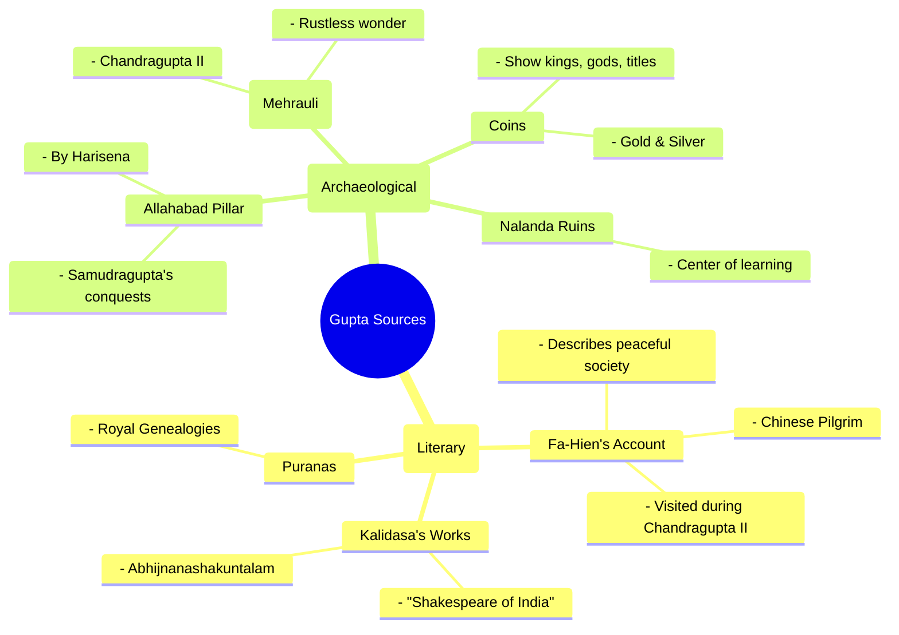

# The Golden Age of the Guptas: An Engaging Study Module

## Table of Contents
1.  **Unlocking the Past:** How We Know About the Guptas (Sources of History)
2.  **The First Great King:** Chandragupta I and the Rise of the Dynasty
3.  **The "Indian Napoleon":** Samudragupta's Conquests and Legacy
4.  **The Golden Zenith:** Chandragupta II (Vikramaditya) and Fa-Hien's India
5.  **Governing the Empire:** The Gupta Administration
6.  **A Flourishing of Genius:** Culture, Science, and Art in the Gupta Era

---

## Segment 1: Unlocking the Past: How We Know About the Guptas

### Objectives
*   **Identify** the two main types of historical sources for the Gupta period.
*   **Describe** the key literary sources, including the accounts of Fa-Hien and the works of Kalidasa.
*   **Explain** the importance of archaeological sources like the Allahabad Pillar and the Iron Pillar at Mehrauli.
*   **Understand** why the Gupta period is considered a well-documented era in ancient Indian history.

### Story Mode: The Time Detectives' Toolkit

How do we know what happened in India almost 1700 years ago? We can't use a time machine, but we can be **time detectives**! Our clues aren't fingerprints, but historical sources left behind. For the Gupta Empire, these clues are so rich and detailed that they paint a vivid picture of a "Golden Age."

Our detective kit has two main trays: **Literary Sources** (written accounts) and **Archaeological Sources** (physical objects).

#### **Tray 1: The Storytellers (Literary Sources)**

**1. The Foreign Correspondent: Fa-Hien's Travel Diary**

**Visual Imagination Prompt:** Picture a Buddhist monk named **Fa-Hien** (pronounced *Fa-Shien*) from China, his robes dusty from the road, carefully noting everything he sees. This wasn't a casual trip; it was a dangerous, years-long pilgrimage on foot to find original Buddhist scriptures. He was like a foreign journalist reporting from a distant, fascinating land.

He visited during the reign of the great king **Chandragupta II**. While his main goal was religion, his diary gives us an incredible, unbiased view of daily life.

*   **Pop Analogy:** Think of Fa-Hien's account as a 5th-century version of a famous travel vlogger's YouTube series. It’s an outsider's honest review of India.
*   **Conceptual View:** His writings provide a socio-political snapshot. He noted that people were wealthy but lived simple lives. The government was mild, punishments were usually just fines (not brutal), and the roads were safe. Different religions like Hinduism, Buddhism, and Jainism co-existed peacefully.
*   **Pure Fact:** Fa-Hien's book, *A Record of Buddhist Kingdoms* (or *Fo-Kwo-Ki*), is a primary source on the social, economic, and religious conditions during Chandragupta II's reign.

**2. The Superstars of Sanskrit: Kalidasa & Vishakhadatta**

If the Gupta period had a celebrity list, **Kalidasa** would be at the top. He was the Shakespeare of his time, a master poet and playwright.

*   **Memory Exaggeration:** Think of Kalidasa as the Virat Kohli of ancient Indian literature—a genius whose name is still legendary nearly two millennia later. His plays (*Abhijnanashakuntalam*) and poems (*Meghaduta*) give us clues about the culture, romance, and ideals of the era.

Another key writer was **Vishakhadatta**. His play *Devi Chandraguptam* is like a historical thriller, giving us the dramatic backstory of King Chandragupta II's rise to power.

**3. The Ancient Encyclopedias: The Puranas**

The Puranas are ancient Hindu texts that blend stories and myths with valuable historical information, including the family trees (genealogies) of kings. The *Vayu Purana*, for example, helps us list the early Gupta rulers.

#### **Tray 2: The Physical Clues (Archaeological Sources)**

**1. The Pillar of Power: The Allahabad Inscription**

**Visual Imagination Prompt:** Imagine a poet, **Harisena**, standing before his king, **Samudragupta**, reciting a powerful poem. This poem, celebrating the king's victories, was so important that it was carved forever onto a massive stone pillar in Allahabad (Prayagraj). This is the **Prayaga Prashasti**. It’s an official, rock-solid (literally!) record of all the kings and kingdoms Samudragupta defeated.

**2. The Rustless Wonder: The Iron Pillar of Mehrauli**

Near the Qutub Minar in Delhi stands a 1600-year-old iron pillar that has **never rusted**. This pillar is a mind-boggling marvel of ancient Indian metallurgy. An inscription on it mentions a powerful king named 'Chandra,' whom historians identify as **Chandragupta II**. It celebrates his victories and is a testament to the scientific genius of the age.

**3. Coins: The Empire's Pocket-Sized Portraits**

Gupta kings issued beautiful gold and silver coins. These aren't just money; they are mini-canvases. They show us what the kings looked like, the grand titles they used (like *Maharajadhiraja* or "king of kings"), the gods they worshipped, and even their hobbies (Samudragupta is shown playing the veena!).

---
### 🔑 Memory Hooks

*   **Fa-Hien & Chandra II:** The two **C**'s go together: The **C**hinese pilgrim visited during **C**handragupta II's reign.
*   **Allahabad & Samudragupta:** The **Allahabad** Pillar sings the praises (*Prashasti*) of **Samudragupta's** mighty army. It was written by his court poet **Harisena** (think *Hari's Sena* or 'God's Army').
*   **Iron Pillar & Chandra II:** The rustless **Iron** pillar shines as bright as a **Chandra** (moon), celebrating **Chandra**gupta II.

---
### Dual Coding Suggestion: Mermaid Mind Map

Here is a Mermaid diagram code for your mind map. You can paste this into a Markdown file on GitHub to see the visual.

---

### Active Recall Checkpoint

**1. Quick Facts (1-mark style):**
   a. Who wrote the Prayaga Prashasti (Allahabad Pillar Inscription)?
   b. During whose reign did the Chinese pilgrim Fa-Hien visit India?
   c. Which Gupta king is shown playing the veena on his coins?

**2. The "Why" Question (2-marks style):**
   *Why are archaeological sources like inscriptions and coins sometimes considered more reliable than literary sources?*
   *(Hint: Think about who writes stories and why. Can stories be biased? Are rocks and metal biased?)*

**3. Mini-Activity: Match the Source to the King!**
   | Source                     | Associated King      |
   | -------------------------- | -------------------- |
   | 1. Allahabad Pillar        | A. Chandragupta II   |
   | 2. Fa-Hien's Account       | B. Samudragupta      |
   | 3. Iron Pillar at Mehrauli | C. Kumaragupta I     |
   | 4. Nalanda University      | D. Chandragupta II   |

*(Answers: 1-B, 2-A, 3-D, 4-C)*
