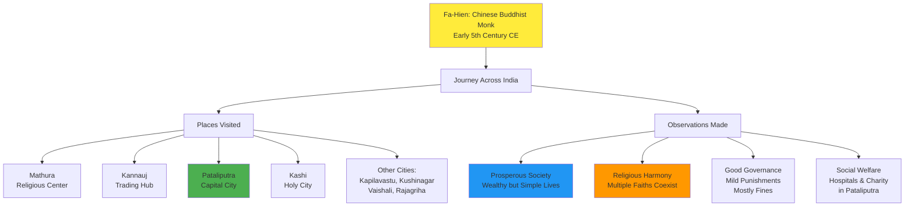
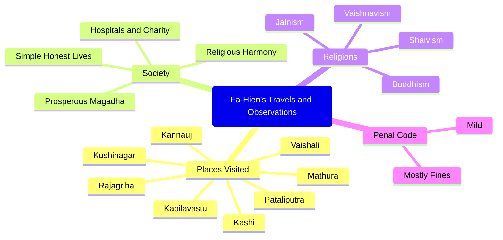
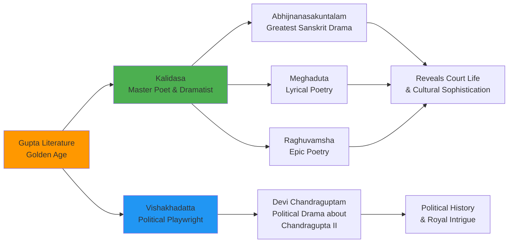
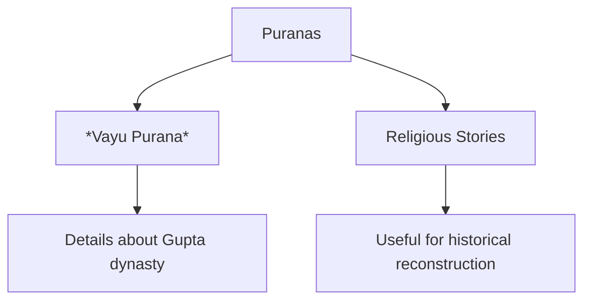
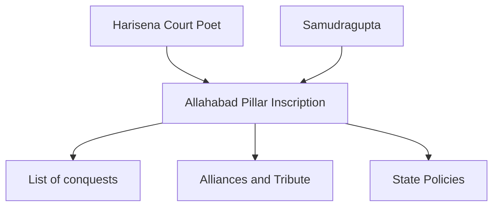
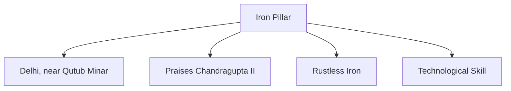
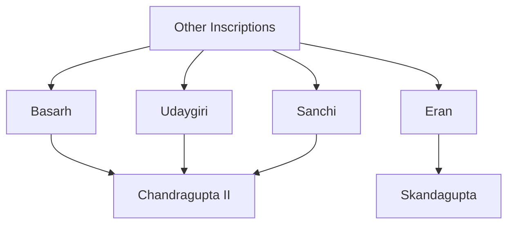
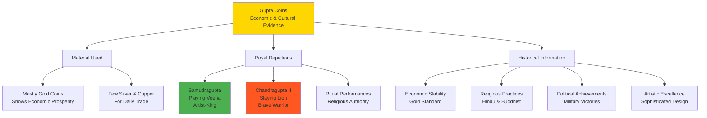
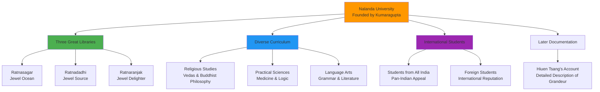

# 📘 Sources of Gupta History

When we try to reconstruct history, it is like piecing together a giant puzzle. Some pieces come from **books and poems**, while others come from **pillars, coins, and ruins** that still survive. Together, they allow us to imagine the world of the Guptas.

---

## (A) Literary Sources

### 1. Fa-Hien’s Account

In the early 5th century CE, a Chinese Buddhist monk named **Fa-Hien** undertook a long journey across India. He walked through forests, crossed rivers, and visited cities like **Mathura, Kannauj, Kapilavastu, Kushinagar, Vaishali, Pataliputra, Kashi, and Rajagriha**. Though his main interest was Buddhism, he left behind valuable observations about society under the Guptas.

Fa-Hien wrote that **Magadha was prosperous**, towns were large, and people enjoyed wealth but lived simple, honest lives. **Pataliputra** stood out with its hospitals and charitable institutions funded by local citizens. Religion was diverse—Vaishnavism, Shaivism, Buddhism, and Jainism—but people lived in harmony. Hindu gods appeared on coins and in temple art. Punishments were mild, with most offences settled by fines.

**Visualization:**

**Dual Code - Table Format:**

| **Aspect** | **Fa-Hien's Observations** | **Historical Significance** |
|------------|----------------------------|------------------------------|
| **Cities Visited** | Mathura, Kannauj, Pataliputra, Kashi, Kapilavastu, Kushinagar, Vaishali, Rajagriha | Shows extent of Gupta influence and trade routes |
| **Society** | Prosperous Magadha, wealthy but simple honest lives | Indicates economic prosperity under Guptas |
| **Religion** | Vaishnavism, Shaivism, Buddhism, Jainism coexisting | Shows religious tolerance of Gupta administration |
| **Governance** | Mild punishments, mostly fines | Suggests humane and efficient legal system |
| **Social Welfare** | Hospitals and charity in Pataliputra | Demonstrates organized public welfare system |

### 2. Literary Works of Kalidasa and Vishakhadatta

**Visualization:**

### 2. Literary Works of Kalidasa and Vishakhadatta

The Gupta period is often called a golden age of literature. **Kalidasa**, the greatest poet and dramatist of this era, wrote masterpieces like *Abhijnanasakuntalam*, *Meghaduta*, and *Raghuvamsha*. His works reveal the sophistication of Gupta culture and court life. Another important writer, **Vishakhadatta**, composed plays such as *Devi Chandraguptam*, which describe the early life of Chandragupta II.

**Visualization:**

**Dual Code - Comparative Table:**

| **Writer** | **Major Works** | **Content Focus** | **Historical Value** |
|------------|-----------------|-------------------|----------------------|
| **Kalidasa** | • Abhijnanasakuntalam • Meghaduta • Raghuvamsha | Court life, love stories, nature, royal culture | Shows sophistication of Gupta society and cultural achievements |
| **Vishakhadatta** | • Devi Chandraguptam | Political drama, royal succession, early life of Chandragupta II | Provides insights into Gupta political history and court intrigue |

### 3. The Puranas

The **Puranas**, especially the *Vayu Purana*, provide historical details about dynasties, rulers, and events. Although primarily religious in nature, they help historians trace the political developments of the Guptas.

**Visualization:**

---

## (B) Archaeological Sources

### 1. The Allahabad Pillar Inscription

One of the most important records of Gupta history is the inscription on the **Allahabad Pillar**. Written in Sanskrit by **Harisena**, the court poet of **Samudragupta**, it describes his conquests, alliances, and policies. This single inscription has been called the foundation of Samudragupta’s fame.

**Visualization:**

### 2. The Iron Pillar of Mehrauli (Delhi)

Near the Qutub Minar in Delhi stands the famous **Iron Pillar**, remarkable for not rusting even after more than 1,600 years. Its inscription praises **Chandragupta II**, celebrated as a powerful ruler. The pillar is also a symbol of the Gupta mastery of metallurgy.

**Visualization:**

### 3. Other Inscriptions

Several other inscriptions add details to Gupta history. The inscriptions at **Basarh, Udaygiri, and Sanchi** provide information about Chandragupta II, while the **Eran inscription** records events from the reign of **Skandagupta**.

**Visualization:**

### 4. Coins

The Guptas issued an impressive variety of coins, mostly in gold. These coins often depict kings in heroic or artistic poses—Samudragupta playing the veena, Chandragupta II slaying a lion, and rulers performing sacrifices. Coins reveal not only the economy but also art, religion, and political achievements of the age.

**Visualization:**

**Dual Code - Information Matrix:**

| **Coin Feature** | **Examples** | **What It Tells Us** |
|------------------|--------------|----------------------|
| **Material** | Mostly gold, some silver/copper | Economic prosperity, stable currency system |
| **Royal Images** | Samudragupta with Veena, Chandragupta II hunting lion | Kings as both warriors and cultural patrons |
| **Religious Symbols** | Hindu gods, Buddhist symbols, sacrifice scenes | Religious tolerance and royal religious authority |
| **Artistic Quality** | Sophisticated designs, detailed imagery | High level of craftsmanship and artistic achievement |

### 5. Nalanda University

Founded during the reign of **Kumaragupta**, **Nalanda University** became one of the greatest centers of learning in the ancient world. It attracted students from across India and beyond. The university had three great libraries—**Ratnasagar, Ratnadadhi, and Ratnaranjak**—and taught subjects ranging from the Vedas to logic, grammar, medicine, and Buddhist philosophy. Later pilgrims like **Hiuen Tsang** left detailed descriptions of its grandeur.

**Visualization:**

**Dual Code - Knowledge Center Analysis:**

| **Aspect** | **Details** | **Historical Significance** |
|------------|-------------|------------------------------|
| **Founder** | Kumaragupta (Gupta Emperor) | Shows royal patronage of education and learning |
| **Libraries** | Ratnasagar, Ratnadadhi, Ratnaranjak | Demonstrates systematic organization of knowledge |
| **Curriculum** | Vedas, Logic, Grammar, Medicine, Buddhist Philosophy | Shows integration of religious and secular education |
| **Student Body** | From all over India and foreign countries | Proves international reputation and cultural exchange |
| **Documentation** | Hiuen Tsang's detailed accounts | Provides external validation of its greatness |

---

## 🔄 Recall Questions

1. Who was Fa-Hien, and what aspects of Gupta society did he describe?
2. Which works of Kalidasa and Vishakhadatta provide insight into Gupta culture and rulers?
3. Which Purana gives useful information about the Gupta dynasty?
4. What is the significance of the Allahabad Pillar inscription of Samudragupta?
5. Why is the Iron Pillar at Mehrauli historically and scientifically important?
6. What information do the inscriptions at Basarh, Udaygiri, and Eran provide?
7. What do Gupta coins tell us about their rulers and society?
8. Who founded Nalanda University, and why was it famous?
