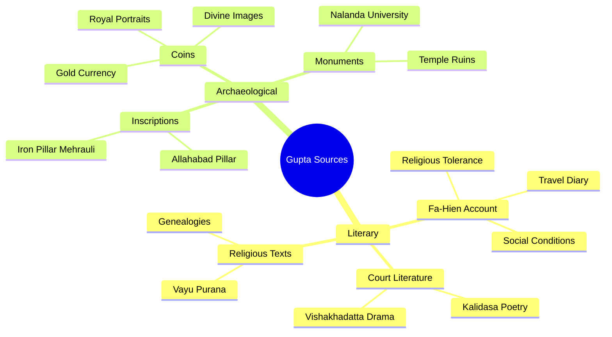
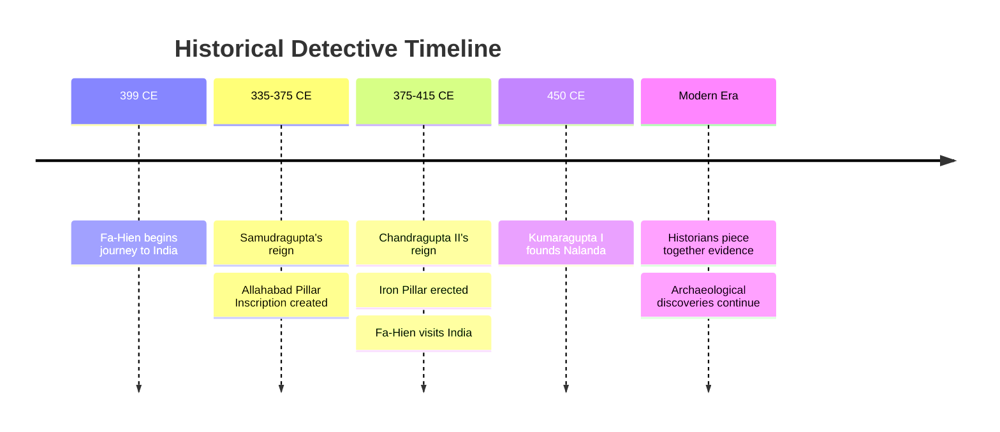

# Segment 1: Unlocking the Past - How We Know About the Guptas
## Documentary Study Module

### 📋 Table of Contents - Section 1
- [🎬 The Documentary Story](#-the-documentary-story)
- [🔑 Memory Hooks](#-memory-hooks)
- [🧠 Recall Check](#-recall-check)
- [📌 Exam Keywords](#-exam-keywords)
- [⚡ Mid-Section Quickfire](#-mid-section-quickfire)
- [📚 STRICT EXAM MODE](#-strict-exam-mode)
- [🎯 One-Sitting Lock-In](#-one-sitting-lock-in)
- [📖 Glossary & Deep Dive](#-glossary--deep-dive)
- [🎨 Visual Learning](#-visual-learning)
- [🃏 Flashcards](#-flashcards)

---

## 🎬 The Documentary Story

Picture this: It's the year 1,700 ago. The great Gupta Empire has vanished into the mists of time. No newspapers, no photographs, no video recordings exist. So how do we know that a Chinese monk named Fa-Hien once walked through the bustling streets of Pataliputra? How do we know that a warrior-king named Samudragupta carved his victories on a stone pillar for eternity? How do we piece together the story of India's Golden Age?

Welcome to the world of historical detection, where every artifact tells a story, every inscription holds secrets, and every coin is a messenger from the past.

**The Time Detectives' Challenge:** Historians studying the Gupta period are like detectives solving a 1,700-year-old mystery. They have two types of evidence in their investigation kit—Literary Sources (written records) and Archaeological Sources (physical evidence). Together, these sources paint such a vivid picture of the Gupta Empire that we can almost hear the temple bells of Pataliputra and see Samudragupta strumming his veena.

**Literary Sources: The Written Testimonies**

The first star witness in our historical court is Fa-Hien, a brave Buddhist monk from China. In 399 CE, he embarked on an extraordinary journey—walking thousands of miles across treacherous mountains and endless deserts to reach India during the reign of Chandragupta II (Vikramaditya). Fa-Hien was like an ancient travel blogger, documenting everything he saw in his book "Fo-Kwo-Ki" (A Record of Buddhist Kingdoms).

Through Fa-Hien's eyes, we see a land of remarkable prosperity and peace. Magadha was wealthy beyond imagination, with large, bustling towns where merchants traded silk for spices and gold for precious gems. The capital city of Pataliputra gleamed like a jewel on the banks of the Ganges, boasting charitable institutions that would make any modern city proud—including a completely free hospital funded not by the government, but by compassionate citizens who believed in helping strangers.

What astonished Fa-Hien most was the character of the people. Despite their wealth, they lived simply, following principles of honesty and non-violence. The roads were so safe that travelers could journey for days without fear of bandits. The legal system was remarkably mild—most crimes were punished with fines rather than imprisonment, and capital punishment was almost unknown. Different religions—Hinduism, Buddhism, Jainism—coexisted peacefully, with no religious conflicts or persecution.

But Fa-Hien also noticed the social hierarchies. He observed that while most people lived harmoniously, there was a group called 'Chandalas' who were treated as outcasts and forced to live outside the main cities. When they entered towns for work, they had to strike wood to announce their presence so others could avoid contact—a practice that reveals both the prosperity and the social contradictions of the time.

The second set of literary witnesses comes from the brilliant court of the Guptas themselves. The great poet Kalidasa, often called the "Shakespeare of India," was writing his masterpiece "Abhijnanashakuntalam" during this very period. His works don't just entertain—they reveal the cultural values, royal customs, and social ideals of the Gupta court. Another court dramatist, Vishakhadatta, wrote "Devi Chandraguptam," a political thriller that tells us about the dramatic rise of Chandragupta II to power.

The ancient Puranas, especially the Vayu Purana, serve as our genealogical guides, providing family trees and chronologies of Gupta rulers that help historians map out the dynasty's timeline.

**Archaeological Sources: The Silent Witnesses**

While literary sources tell us what people thought and felt, archaeological sources show us what actually happened. The most spectacular piece of evidence is the Allahabad Pillar Inscription, also known as the Prayaga Prashasti. Imagine Samudragupta, flush with victory after conquering vast territories, commissioning his court poet Harisena to compose a grand eulogy that would be carved in Sanskrit on an ancient pillar built by Emperor Ashoka centuries earlier.

This inscription is like finding Samudragupta's official military resume written in stone. It meticulously lists every king he defeated, every territory he conquered, and every tribe he subdued. It's so detailed that historians can trace his military campaigns like following a GPS route across ancient India—from the Naga kingdoms of Mathura and Gwalior in the north to the powerful rulers of the Deccan in the south.

Near the Qutub Minar in Delhi stands another remarkable witness—the Iron Pillar of Mehrauli. This 1,600-year-old pillar has survived centuries of monsoons, scorching summers, and countless storms without a single spot of rust. An inscription on this metallurgical marvel celebrates the victories of a king named 'Chandra'—identified by historians as Chandragupta II. The pillar itself is proof of the incredible scientific and engineering capabilities of the Gupta period.

Gupta coins are like tiny time capsules, each one carrying messages from the past. These weren't just currency—they were miniature propaganda posters. Some show Samudragupta playing the veena, revealing his artistic side. Others display the grand titles like "Maharajadhiraja" (King of Kings) and show the gods and goddesses the rulers worshipped. The quality and artistry of these gold coins reflect the economic prosperity and cultural sophistication of the empire.

Finally, the ruins of Nalanda University in Bihar stand as a monument to the Gupta commitment to education. Founded during Kumaragupta I's reign, this was one of the world's first great residential universities. Its three massive libraries—Ratnasagar (Ocean of Gems), Ratnodadhi (Ocean of Jewels), and Ratnaranjak (Jewel Adorned)—housed thousands of manuscripts. Students from China, Tibet, Korea, and Central Asia traveled here to study everything from Buddhist philosophy to medicine, mathematics to astronomy.

**The Historical Detective's Conclusion**

What makes the Gupta period unique in Indian history is this rich abundance of evidence. Unlike earlier periods where historians must work with fragmentary clues, the Guptas left behind a treasure trove of sources that allow us to reconstruct not just political events, but the daily lives, beliefs, and aspirations of people who lived 1,700 years ago. From Fa-Hien's travel diary to Samudragupta's stone resume, from rustless iron pillars to golden coins, every piece of evidence contributes to our understanding of why this era earned the title "Golden Age" of Indian civilization.

---

## 🔑 Memory Hooks

**The Big 4 Literary Sources:**
1. **Fa-Hien's "Fo-Kwo-Ki"** - Chinese monk's travel diary (399 CE)
2. **Kalidasa's works** - Court poet's masterpieces (Abhijnanashakuntalam)
3. **Vishakhadatta's "Devi Chandraguptam"** - Political drama about Chandragupta II
4. **Vayu Purana** - Genealogical records of Gupta dynasty

**The Big 4 Archaeological Sources:**
1. **Allahabad Pillar Inscription** - Samudragupta's military resume by Harisena
2. **Iron Pillar at Mehrauli** - Rustless wonder celebrating Chandragupta II
3. **Gupta Coins** - Golden propaganda with royal portraits and divine images
4. **Nalanda University Ruins** - World's first great residential university

---

## 🧠 Recall Check

1. What was the title of Fa-Hien's book about India?
2. Which court poet wrote the Allahabad Pillar Inscription?
3. Name the three great libraries of Nalanda University.
4. What does "Maharajadhiraja" mean?
5. **Reasoning Question:** Why do historians consider the Gupta period well-documented compared to earlier Indian dynasties?

**Quick Answers:**
1. Fo-Kwo-Ki (A Record of Buddhist Kingdoms)
2. Harisena
3. Ratnasagar, Ratnodadhi, Ratnaranjak
4. King of Kings
5. Rich variety of both literary and archaeological sources available

---

## 📌 Exam Keywords

**ICSE Examiner Language:** *sources, reconstruction, inscription, archaeological evidence, literary accounts, chronology, contemporary records, epigraphic sources, numismatic evidence, foreign accounts*

---

## ⚡ Mid-Section Quickfire

**Rapid-Fire Questions (1 mark each):**

1. Name one literary and one archaeological source for the Gupta period.
2. Who was Fa-Hien?
3. What is the other name for the Allahabad Pillar Inscription?
4. Which metal was used for most Gupta coins?
5. Name the founder of Nalanda University.
6. What was Vishakhadatta's famous political play called?
7. Which Purana gives genealogical information about the Guptas?
8. What instrument is Samudragupta shown playing on his coins?

**Answers:**
1. Literary: Fa-Hien's account; Archaeological: Allahabad Pillar Inscription
2. Chinese Buddhist monk who visited India during Chandragupta II's reign
3. Prayaga Prashasti
4. Gold
5. Kumaragupta I
6. Devi Chandraguptam
7. Vayu Purana
8. Veena

---

## 📚 STRICT EXAM MODE

### One-Mark Questions:
1. Name the famous inscription that tells us about Samudragupta's military achievements.
2. What is the title of the book Fa-Hien wrote about India?
3. Who destroyed Nalanda University?
4. During whose reign did Fa-Hien visit India?

### Short Answer Questions (2-3 marks):
1. What did Fa-Hien write about the city of Pataliputra?
2. Who was the greatest literary genius of the Gupta period? Name two of his works.
3. What does the Allahabad Pillar Inscription tell us about Samudragupta?

### Long Answer Questions (5 marks):
1. **"There are many literary sources to reconstruct the Age of the Guptas."** In this context, explain the significance of Fa-Hien's account.

**Model Answer Structure:**
- **Introduction:** Fa-Hien as a valuable foreign contemporary source
- **His journey:** Chinese Buddhist monk visiting during Chandragupta II's reign (399 CE)
- **His observations:** Prosperous society, mild governance, religious tolerance, social conditions
- **Historical significance:** Provides unbiased external perspective on Gupta administration and society
- **Conclusion:** Confirms the prosperity and enlightened rule of the Gupta period

2. **Regarding archaeological sources, explain the significance of: (a) Allahabad Pillar Inscription (b) Nalanda University**

**Model Answer for (a):**
- **Identification:** Most important epigraphic source for Samudragupta's reign
- **Details:** Written by court poet Harisena, carved on Ashokan pillar
- **Content:** Detailed list of conquered territories and defeated rulers
- **Historical value:** Provides firsthand account of military campaigns and imperial policies
- **Significance:** Called "single record" on which rests Samudragupta's fame

**Model Answer for (b):**
- **Identification:** World-renowned educational institution founded by Kumaragupta I
- **Features:** Three great libraries, international student body, diverse curriculum
- **Subjects:** Vedas, logic, grammar, medicine, Buddhist philosophy
- **Significance:** Demonstrates Gupta commitment to education and learning
- **Global impact:** Attracted students from China, Tibet, Korea, making it an international center

---

## 🎯 One-Sitting Lock-In

### Blind Recall Sheet
**Write down 10 key facts about Gupta sources without looking:**
1. ________________
2. ________________
3. ________________
4. ________________
5. ________________
6. ________________
7. ________________
8. ________________
9. ________________
10. ________________

### 60-Second Cram Card
**Gupta Sources Summary (<120 words):**
Literary sources include Fa-Hien's Fo-Kwo-Ki describing prosperous Gupta society, Kalidasa's masterpieces revealing court culture, Vishakhadatta's political dramas, and Puranas providing genealogies. Archaeological sources feature Allahabad Pillar Inscription by Harisena detailing Samudragupta's conquests, Iron Pillar at Mehrauli celebrating Chandragupta II, artistic Gupta coins showing royal portraits and titles, and Nalanda University ruins demonstrating educational excellence. These diverse sources make Gupta period well-documented, allowing historians to reconstruct political events, social conditions, religious practices, and cultural achievements of India's Golden Age.

### Long-Answer Drill (5 minutes)
**Practice Question:** "Archaeological sources are crucial for understanding the Gupta period." Discuss with reference to specific examples.

---

## 📖 Glossary & Deep Dive

**Fa-Hien (399-413 CE):** Chinese Buddhist monk and scholar who traveled to India seeking original Buddhist scriptures. His detailed account "Fo-Kwo-Ki" provides invaluable insights into Gupta society, administration, and religious practices during Chandragupta II's reign.

**Allahabad Pillar Inscription (Prayaga Prashasti):** Sanskrit eulogy composed by court poet Harisena, carved on an Ashokan pillar. Contains detailed records of Samudragupta's military campaigns and conquests, making it the primary source for his reign.

**Harisena:** Court poet of Samudragupta, composer of the famous Allahabad Pillar Inscription. His literary skill combined with historical accuracy makes this inscription both an artistic masterpiece and crucial historical document.

**Nalanda University:** Ancient center of learning founded during Kumaragupta I's reign. Featured three great libraries and attracted international students. Represents the pinnacle of educational achievement during the Gupta period.

**Numismatic Evidence:** Study of Gupta coins reveals information about rulers' titles, religious beliefs, artistic traditions, and economic prosperity. Coins served as both currency and propaganda tools.

---

## 🎨 Visual Learning

*Caption: The two main categories of sources that help historians reconstruct the Gupta Golden Age*

*Caption: Timeline showing when our major sources were created and discovered*

---

## 🃏 Flashcards

**Card 1**
Q: What was Fa-Hien's book called?
A: Fo-Kwo-Ki (A Record of Buddhist Kingdoms)

**Card 2**
Q: Who wrote the Allahabad Pillar Inscription?
A: Harisena, court poet of Samudragupta

**Card 3**
Q: Name Nalanda's three libraries
A: Ratnasagar, Ratnodadhi, Ratnaranjak

**Card 4**
Q: What does the Iron Pillar prove?
A: Advanced Gupta metallurgical skills (rustless for 1600+ years)

**Card 5**
Q: Which ruler founded Nalanda University?
A: Kumaragupta I

**Card 6**
Q: What were Gupta coins made of primarily?
A: Gold

**Card 7**
Q: Name Vishakhadatta's famous political play
A: Devi Chandraguptam

**Card 8**
Q: Which Purana helps with Gupta genealogy?
A: Vayu Purana

**Card 9**
Q: What instrument did Samudragupta play?
A: Veena (shown on his coins)

**Card 10**
Q: What does "Prayaga Prashasti" mean?
A: Another name for the Allahabad Pillar Inscription

---

### 🌟 You've Got This!

**Congratulations!** You now know both the **stories** and the **facts** behind how historians uncover the secrets of the Gupta Golden Age. From Fa-Hien's amazing journey to the rustless iron pillar that still stands today, you have all the source knowledge needed to ace your ICSE History exam. These historical detectives' tools will help you answer any question about Gupta sources with confidence and full marks!
