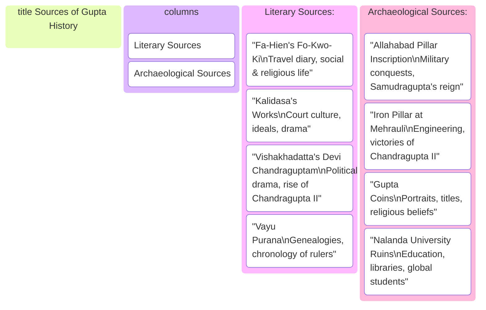
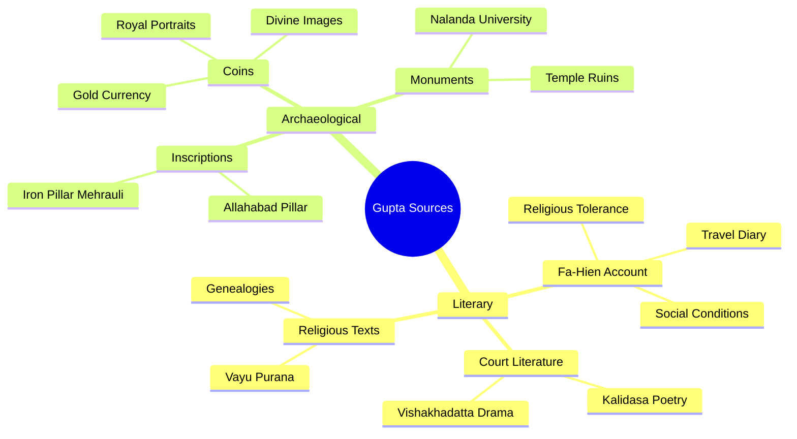
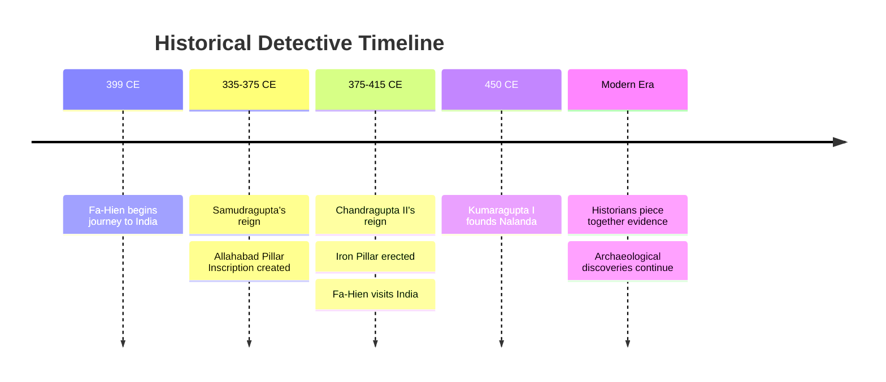

# Segment 1: Unlocking the Past - How We Know About the Guptas
## Documentary Study Module

### 📋 Table of Contents - Section 1
- [Segment 1: Unlocking the Past - How We Know About the Guptas](#segment-1-unlocking-the-past---how-we-know-about-the-guptas)
  - [Documentary Study Module](#documentary-study-module)
    - [📋 Table of Contents - Section 1](#-table-of-contents---section-1)
  - [🎬 The Documentary Story](#-the-documentary-story)
  - [🔑 Memory Hooks](#-memory-hooks)
  - [🗂️ Visual Kanban: Sources of Gupta History](#️-visual-kanban-sources-of-gupta-history)
  - [🧠 Recall Check](#-recall-check)
  - [📌 Exam Keywords](#-exam-keywords)
  - [⚡ Mid-Section Quickfire](#-mid-section-quickfire)
  - [📚 STRICT EXAM MODE](#-strict-exam-mode)
    - [One-Mark Questions:](#one-mark-questions)
    - [Short Answer Questions (2-3 marks):](#short-answer-questions-2-3-marks)
    - [Long Answer Questions (5 marks):](#long-answer-questions-5-marks)
  - [🎯 One-Sitting Lock-In](#-one-sitting-lock-in)
    - [Blind Recall Sheet](#blind-recall-sheet)
    - [60-Second Cram Card](#60-second-cram-card)
    - [Long-Answer Drill (5 minutes)](#long-answer-drill-5-minutes)
  - [📖 Glossary \& Deep Dive](#-glossary--deep-dive)
  - [🎨 Visual Learning](#-visual-learning)
  - [🃏 Flashcards](#-flashcards)
    - [🌟 You've Got This!](#-youve-got-this)

---

## 🎬 The Documentary Story

Picture this: It's the year 1,700 ago. The great Gupta Empire has vanished into the mists of time. No newspapers, no photographs, no video recordings exist. So how do we know that a Chinese monk named Fa-Hien once walked through the bustling streets of Pataliputra? How do we know that a warrior-king named Samudragupta carved his victories on a stone pillar for eternity? How do we piece together the story of India's Golden Age?

Welcome to the world of historical detection, where every artifact tells a story, every inscription holds secrets, and every coin is a messenger from the past.

**The Time Detectives' Challenge:** Historians studying the Gupta period are like detectives solving a 1,700-year-old mystery. They have two types of evidence in their investigation kit—Literary Sources (written records) and Archaeological Sources (physical evidence). Together, these sources paint such a vivid picture of the Gupta Empire that we can almost hear the temple bells of Pataliputra and see Samudragupta strumming his veena.

**Literary Sources: The Written Testimonies**

```mermaid
block
  Fa-Hien[Fa-Hien's Fo-Kwo-Ki\nTravel diary, social & religious life]
  Kalidasa[Kalidasa's Works\nCourt culture, ideals, drama]
  Vishakhadatta[Vishakhadatta's Devi Chandraguptam\nPolitical drama, rise of Chandragupta II]
  VayuPurana[Vayu Purana\nGenealogies, chronology of rulers]
  Fa-Hien --> Kalidasa
  Fa-Hien --> Vishakhadatta
  Fa-Hien --> VayuPurana
```

*Caption: Block diagram showing the main literary sources and how each contributes to our understanding of the Gupta Age*

The first star witness in our historical court is Fa-Hien, a brave Buddhist monk from China. In 399 CE, he embarked on an extraordinary journey—walking thousands of miles across treacherous mountains and endless deserts to reach India during the reign of Chandragupta II (Vikramaditya). Fa-Hien was like an ancient travel blogger, documenting everything he saw in his book "Fo-Kwo-Ki" (A Record of Buddhist Kingdoms).

Through Fa-Hien's eyes, we see a land of remarkable prosperity and peace. Magadha was wealthy beyond imagination, with large, bustling towns where merchants traded silk for spices and gold for precious gems. The capital city of Pataliputra gleamed like a jewel on the banks of the Ganges, boasting charitable institutions that would make any modern city proud—including a completely free hospital funded not by the government, but by compassionate citizens who believed in helping strangers.

What astonished Fa-Hien most was the character of the people. Despite their wealth, they lived simply, following principles of honesty and non-violence. The roads were so safe that travelers could journey for days without fear of bandits. The legal system was remarkably mild—most crimes were punished with fines rather than imprisonment, and capital punishment was almost unknown. Different religions—Hinduism, Buddhism, Jainism—coexisted peacefully, with no religious conflicts or persecution.

But Fa-Hien also noticed the social hierarchies. He observed that while most people lived harmoniously, there was a group called 'Chandalas' who were treated as outcasts and forced to live outside the main cities. When they entered towns for work, they had to strike wood to announce their presence so others could avoid contact—a practice that reveals both the prosperity and the social contradictions of the time.

The second set of literary witnesses comes from the brilliant court of the Guptas themselves. The great poet Kalidasa, often called the "Shakespeare of India," was writing his masterpiece "Abhijnanashakuntalam" during this very period. His works don't just entertain—they reveal the cultural values, royal customs, and social ideals of the Gupta court. Another court dramatist, Vishakhadatta, wrote "Devi Chandraguptam," a political thriller that tells us about the dramatic rise of Chandragupta II to power.

The ancient Puranas, especially the Vayu Purana, serve as our genealogical guides, providing family trees and chronologies of Gupta rulers that help historians map out the dynasty's timeline.

**Archaeological Sources: The Silent Witnesses**

```mermaid
block
  AllahabadPillar[Allahabad Pillar Inscription\nMilitary conquests, Samudragupta's reign]
  IronPillar[Iron Pillar at Mehrauli\nEngineering, victories of Chandragupta II]
  GuptaCoins[Gupta Coins\nPortraits, titles, religious beliefs]
  Nalanda[Ruins of Nalanda University\nEducation, libraries, global students]
  AllahabadPillar --> IronPillar
  AllahabadPillar --> GuptaCoins
  AllahabadPillar --> Nalanda
```

*Caption: Block diagram showing the main archaeological sources and how each reveals a different aspect of the Gupta Age*

While literary sources tell us what people thought and felt, archaeological sources show us what actually happened. The most spectacular piece of evidence is the Allahabad Pillar Inscription, also known as the Prayaga Prashasti. Imagine Samudragupta, flush with victory after conquering vast territories, commissioning his court poet Harisena to compose a grand eulogy that would be carved in Sanskrit on an ancient pillar built by Emperor Ashoka centuries earlier.

This inscription is like finding Samudragupta's official military resume written in stone. It meticulously lists every king he defeated, every territory he conquered, and every tribe he subdued. It's so detailed that historians can trace his military campaigns like following a GPS route across ancient India—from the Naga kingdoms of Mathura and Gwalior in the north to the powerful rulers of the Deccan in the south.

Near the Qutub Minar in Delhi stands another remarkable witness—the Iron Pillar of Mehrauli. This 1,600-year-old pillar has survived centuries of monsoons, scorching summers, and countless storms without a single spot of rust. An inscription on this metallurgical marvel celebrates the victories of a king named 'Chandra'—identified by historians as Chandragupta II. The pillar itself is proof of the incredible scientific and engineering capabilities of the Gupta period.

Gupta coins are like tiny time capsules, each one carrying messages from the past. These weren't just currency—they were miniature propaganda posters. Some show Samudragupta playing the veena, revealing his artistic side. Others display the grand titles like "Maharajadhiraja" (King of Kings) and show the gods and goddesses the rulers worshipped. The quality and artistry of these gold coins reflect the economic prosperity and cultural sophistication of the empire.

Finally, the ruins of Nalanda University in Bihar stand as a monument to the Gupta commitment to education. Founded during Kumaragupta I's reign, this was one of the world's first great residential universities. Its three massive libraries—Ratnasagar (Ocean of Gems), Ratnodadhi (Ocean of Jewels), and Ratnaranjak (Jewel Adorned)—housed thousands of manuscripts. Students from China, Tibet, Korea, and Central Asia traveled here to study everything from Buddhist philosophy to medicine, mathematics to astronomy.

**The Historical Detective's Conclusion**

What makes the Gupta period unique in Indian history is this rich abundance of evidence. Unlike earlier periods where historians must work with fragmentary clues, the Guptas left behind a treasure trove of sources that allow us to reconstruct not just political events, but the daily lives, beliefs, and aspirations of people who lived 1,700 years ago. From Fa-Hien's travel diary to Samudragupta's stone resume, from rustless iron pillars to golden coins, every piece of evidence contributes to our understanding of why this era earned the title "Golden Age" of Indian civilization.

---

## 🔑 Memory Hooks

**The Big 4 Literary Sources:**
1. **Fa-Hien's "Fo-Kwo-Ki"** - Chinese monk's travel diary (399 CE)
2. **Kalidasa's works** - Court poet's masterpieces (Abhijnanashakuntalam)
3. **Vishakhadatta's "Devi Chandraguptam"** - Political drama about Chandragupta II
4. **Vayu Purana** - Genealogical records of Gupta dynasty

**The Big 4 Archaeological Sources:**
1. **Allahabad Pillar Inscription** - Samudragupta's military resume by Harisena
2. **Iron Pillar at Mehrauli** - Rustless wonder celebrating Chandragupta II
3. **Gupta Coins** - Golden propaganda with royal portraits and divine images
4. **Nalanda University Ruins** - World's first great residential university

---

## 🗂️ Visual Kanban: Sources of Gupta History



*Caption: Kanban board showing how historians organize the main sources for reconstructing the Gupta Golden Age*


## 🧠 Recall Check


1. What was the title of Fa-Hien's book about India?
2. Which court poet wrote the Allahabad Pillar Inscription?
3. Name the three great libraries of Nalanda University.
4. What does "Maharajadhiraja" mean?
5. Why do historians consider the Gupta period well-documented compared to earlier Indian dynasties?
6. Who was the founder of Nalanda University?
7. Which ruler's reign did Fa-Hien visit India?
8. Name the famous play written by Vishakhadatta.
9. Which Purana provides genealogical information about the Guptas?
10. What instrument is Samudragupta shown playing on his coins?
11. What is the other name for the Allahabad Pillar Inscription?
12. Which metal was used for most Gupta coins?
13. Name two foreign visitors to India during the Gupta period.
14. What does the Iron Pillar at Mehrauli prove about Gupta technology?
15. Which city was the capital of the Gupta Empire?
16. What was the main purpose of the Allahabad Pillar Inscription?
17. Name one archaeological and one literary source for the Gupta period.
18. What is numismatic evidence?
19. Who was Kalidasa and why is he important?
20. What subjects were taught at Nalanda University?
21. Which dynasty is known as the "Golden Age" of Indian civilization?
22. What is the significance of the Vayu Purana?
23. Which group was treated as outcasts in Gupta society?
24. What was the legal system like during the Gupta period?
25. Name a charitable institution mentioned by Fa-Hien.
26. What languages were inscriptions during the Gupta period usually written in?
27. What is an epigraphic source?
28. What do Gupta coins reveal about the rulers?
29. Why did students from other countries come to Nalanda?
30. What is the meaning of "Prayaga Prashasti"?
31. Who composed the Allahabad Pillar Inscription?
32. What is the historical value of the Iron Pillar inscription?
33. Which ruler is associated with the Iron Pillar at Mehrauli?
34. What is the role of archaeological sources in history?
35. What is the importance of literary sources?
36. What is a primary source in history?
37. Name a drama written during the Gupta period.
38. What is the role of Harisena in Gupta history?
39. What is the significance of gold coins in the Gupta period?
40. What is the meaning of "Ratnasagar"?

**Quick Answers:**
1. Fo-Kwo-Ki (A Record of Buddhist Kingdoms)
2. Harisena
3. Ratnasagar, Ratnodadhi, Ratnaranjak
4. King of Kings
5. Rich variety of both literary and archaeological sources available
6. Kumaragupta I
7. Chandragupta II
8. Devi Chandraguptam
9. Vayu Purana
10. Veena
11. Prayaga Prashasti
12. Gold
13. Fa-Hien, (Xuanzang for later periods)
14. Advanced metallurgical skills (rustless for 1600+ years)
15. Pataliputra
16. To record Samudragupta's military achievements
17. Allahabad Pillar Inscription (archaeological), Fa-Hien's account (literary)
18. Evidence from coins
19. Court poet, wrote Abhijnanashakuntalam, reveals court culture
20. Vedas, logic, grammar, medicine, Buddhist philosophy
21. Gupta dynasty
22. Provides genealogical records of Gupta rulers
23. Chandalas
24. Mild, mostly fines, rare capital punishment
25. Free hospital in Pataliputra
26. Sanskrit
27. Written inscription as historical evidence
28. Portraits, titles, religious beliefs
29. International reputation for learning
30. Another name for Allahabad Pillar Inscription
31. Harisena
32. Celebrates victories of Chandragupta II, shows engineering skill
33. Chandragupta II
34. Shows what actually happened, physical evidence
35. Shows what people thought, felt, and recorded
36. Direct evidence from the time (e.g., inscriptions, coins)
37. Abhijnanashakuntalam
38. Court poet, composed Allahabad Pillar Inscription
39. Shows prosperity, artistic skill, religious beliefs
40. Ocean of Gems (library at Nalanda)

---

## 📌 Exam Keywords

**ICSE Examiner Language:** *sources, reconstruction, inscription, archaeological evidence, literary accounts, chronology, contemporary records, epigraphic sources, numismatic evidence, foreign accounts*

---

## ⚡ Mid-Section Quickfire

**Rapid-Fire Questions (1 mark each):**


1. Name one literary and one archaeological source for the Gupta period.
2. Who was Fa-Hien?
3. What is the other name for the Allahabad Pillar Inscription?
4. Which metal was used for most Gupta coins?
5. Name the founder of Nalanda University.
6. What was Vishakhadatta's famous political play called?
7. Which Purana gives genealogical information about the Guptas?
8. What instrument is Samudragupta shown playing on his coins?
9. Who wrote the Allahabad Pillar Inscription?
10. Name the capital city of the Gupta Empire.
11. What does "Maharajadhiraja" mean?
12. Name one charitable institution mentioned by Fa-Hien.
13. Which ruler is associated with the Iron Pillar at Mehrauli?
14. What is numismatic evidence?
15. Name the three great libraries of Nalanda University.
16. What language were most Gupta inscriptions written in?
17. Who was Kalidasa?
18. What is the significance of the Vayu Purana?
19. Name a group treated as outcasts in Gupta society.
20. What is an epigraphic source?
21. What is the meaning of "Ratnasagar"?
22. Name a foreign visitor to India during the Gupta period.
23. What does the Iron Pillar inscription celebrate?
24. What is the role of Harisena in Gupta history?
25. What is the historical value of Gupta coins?
26. What subjects were taught at Nalanda University?
27. What was the legal system like during the Gupta period?
28. Why did students from other countries come to Nalanda?
29. What is the meaning of "Prayaga Prashasti"?
30. What is the main purpose of the Allahabad Pillar Inscription?
31. Name a drama written during the Gupta period.
32. What is the significance of gold coins in the Gupta period?
33. Which dynasty is known as the "Golden Age" of Indian civilization?
34. What is the role of archaeological sources in history?
35. What is the importance of literary sources?
36. What is a primary source in history?
37. Name a charitable act described by Fa-Hien.
38. What is the meaning of "Ratnodadhi"?
39. Name a monument built during the Gupta period.
40. What is the meaning of "Ratnaranjak"?

**Answers:**
1. Literary: Fa-Hien's account; Archaeological: Allahabad Pillar Inscription
2. Chinese Buddhist monk who visited India during Chandragupta II's reign
3. Prayaga Prashasti
4. Gold
5. Kumaragupta I
6. Devi Chandraguptam
7. Vayu Purana
8. Veena
9. Harisena
10. Pataliputra
11. King of Kings
12. Free hospital in Pataliputra
13. Chandragupta II
14. Evidence from coins
15. Ratnasagar, Ratnodadhi, Ratnaranjak
16. Sanskrit
17. Court poet, wrote Abhijnanashakuntalam
18. Provides genealogical records of Gupta rulers
19. Chandalas
20. Written inscription as historical evidence
21. Ocean of Gems (library at Nalanda)
22. Fa-Hien
23. Victories of Chandragupta II
24. Court poet, composed Allahabad Pillar Inscription
25. Shows portraits, titles, religious beliefs, prosperity
26. Vedas, logic, grammar, medicine, Buddhist philosophy
27. Mild, mostly fines, rare capital punishment
28. International reputation for learning
29. Another name for Allahabad Pillar Inscription
30. To record Samudragupta's military achievements
31. Abhijnanashakuntalam
32. Shows prosperity, artistic skill, religious beliefs
33. Gupta dynasty
34. Shows what actually happened, physical evidence
35. Shows what people thought, felt, and recorded
36. Direct evidence from the time (e.g., inscriptions, coins)
37. Free hospital for strangers
38. Ocean of Jewels (library at Nalanda)
39. Nalanda University
40. Jewel Adorned (library at Nalanda)

---

## 📚 STRICT EXAM MODE

### One-Mark Questions:

1. Name the famous inscription that tells us about Samudragupta's military achievements.
2. What is the title of the book Fa-Hien wrote about India?
3. Who destroyed Nalanda University?
4. During whose reign did Fa-Hien visit India?
5. Name the founder of Nalanda University.
6. What was Vishakhadatta's famous political play called?
7. Which Purana gives genealogical information about the Guptas?
8. What instrument is Samudragupta shown playing on his coins?
9. Who wrote the Allahabad Pillar Inscription?
10. Name the capital city of the Gupta Empire.
11. What does "Maharajadhiraja" mean?
12. Name one charitable institution mentioned by Fa-Hien.
13. Which ruler is associated with the Iron Pillar at Mehrauli?
14. What is numismatic evidence?
15. Name the three great libraries of Nalanda University.
16. What language were most Gupta inscriptions written in?
17. Who was Kalidasa?
18. What is the significance of the Vayu Purana?
19. Name a group treated as outcasts in Gupta society.
20. What is an epigraphic source?
21. What is the meaning of "Ratnasagar"?
22. Name a foreign visitor to India during the Gupta period.
23. What does the Iron Pillar inscription celebrate?
24. What is the role of Harisena in Gupta history?
25. What is the historical value of Gupta coins?
26. What subjects were taught at Nalanda University?
27. What was the legal system like during the Gupta period?
28. Why did students from other countries come to Nalanda?
29. What is the meaning of "Prayaga Prashasti"?
30. What is the main purpose of the Allahabad Pillar Inscription?
31. Name a drama written during the Gupta period.
32. What is the significance of gold coins in the Gupta period?
33. Which dynasty is known as the "Golden Age" of Indian civilization?
34. What is the role of archaeological sources in history?
35. What is the importance of literary sources?
36. What is a primary source in history?
37. Name a charitable act described by Fa-Hien.
38. What is the meaning of "Ratnodadhi"?
39. Name a monument built during the Gupta period.
40. What is the meaning of "Ratnaranjak"?

### Short Answer Questions (2-3 marks):

1. What did Fa-Hien write about the city of Pataliputra?
2. Who was the greatest literary genius of the Gupta period? Name two of his works.
3. What does the Allahabad Pillar Inscription tell us about Samudragupta?
4. List any three features of Nalanda University during the Gupta period.
5. Explain the significance of Gupta coins as historical sources.
6. How did Fa-Hien describe the social conditions in Gupta India?
7. What information do we get from the Vayu Purana about the Guptas?
8. State two reasons why the Gupta period is called the "Golden Age" of India.
9. What does the Iron Pillar inscription reveal about Chandragupta II?
10. Mention two ways in which archaeological sources differ from literary sources.
11. What was the role of Harisena in Gupta history?
12. Name two charitable institutions mentioned by Fa-Hien and their importance.
13. How did the legal system function during the Gupta period?
14. List any two foreign visitors to India during the Gupta period and their contributions.
15. What do the three libraries of Nalanda University tell us about education in Gupta times?
16. How did the Guptas promote religious tolerance?
17. What is meant by numismatic evidence? Give two examples from the Gupta period.
18. State two facts about the Chandalas in Gupta society.
19. How do inscriptions help historians reconstruct ancient history?
20. What is the importance of epigraphic sources in the study of the Gupta Age?

### Long Answer Questions (5 marks):

1. **"There are many literary sources to reconstruct the Age of the Guptas."** In this context, explain the significance of Fa-Hien's account.

**Model Answer Structure:**
- **Introduction:** Fa-Hien as a valuable foreign contemporary source
- **His journey:** Chinese Buddhist monk visiting during Chandragupta II's reign (399 CE)
- **His observations:** Prosperous society, mild governance, religious tolerance, social conditions
- **Historical significance:** Provides unbiased external perspective on Gupta administration and society
- **Conclusion:** Confirms the prosperity and enlightened rule of the Gupta period

2. **Regarding archaeological sources, explain the significance of: (a) Allahabad Pillar Inscription (b) Nalanda University**

**Model Answer for (a):**
- **Identification:** Most important epigraphic source for Samudragupta's reign
- **Details:** Written by court poet Harisena, carved on Ashokan pillar
- **Content:** Detailed list of conquered territories and defeated rulers
- **Historical value:** Provides firsthand account of military campaigns and imperial policies
- **Significance:** Called "single record" on which rests Samudragupta's fame

**Model Answer for (b):**
- **Identification:** World-renowned educational institution founded by Kumaragupta I
- **Features:** Three great libraries, international student body, diverse curriculum
- **Subjects:** Vedas, logic, grammar, medicine, Buddhist philosophy
- **Significance:** Demonstrates Gupta commitment to education and learning
- **Global impact:** Attracted students from China, Tibet, Korea, making it an international center

3. **"Coins and inscriptions are more reliable than literary sources for reconstructing ancient history." Discuss with reference to the Gupta period.**

4. **Describe the contributions of Kalidasa and Vishakhadatta to our understanding of Gupta society and culture.**

5. **Compare and contrast the information provided by literary and archaeological sources about the Gupta Age.**

6. **Explain the role of Nalanda University in the cultural and educational development of the Gupta period.**

7. **How do foreign accounts, such as those of Fa-Hien, complement Indian sources in reconstructing the history of the Guptas?**

8. **Discuss the importance of religious tolerance and social conditions in the Gupta Empire, as revealed by various sources.**

---

## 🎯 One-Sitting Lock-In

### Blind Recall Sheet
**Write down 10 key facts about Gupta sources without looking:**
1. ________________
2. ________________
3. ________________
4. ________________
5. ________________
6. ________________
7. ________________
8. ________________
9. ________________
10. ________________

### 60-Second Cram Card
**Gupta Sources Summary (<120 words):**
Literary sources include Fa-Hien's Fo-Kwo-Ki describing prosperous Gupta society, Kalidasa's masterpieces revealing court culture, Vishakhadatta's political dramas, and Puranas providing genealogies. Archaeological sources feature Allahabad Pillar Inscription by Harisena detailing Samudragupta's conquests, Iron Pillar at Mehrauli celebrating Chandragupta II, artistic Gupta coins showing royal portraits and titles, and Nalanda University ruins demonstrating educational excellence. These diverse sources make Gupta period well-documented, allowing historians to reconstruct political events, social conditions, religious practices, and cultural achievements of India's Golden Age.

### Long-Answer Drill (5 minutes)
**Practice Question:** "Archaeological sources are crucial for understanding the Gupta period." Discuss with reference to specific examples.

---

## 📖 Glossary & Deep Dive


**Fa-Hien (399-413 CE):** Chinese Buddhist monk and scholar who traveled to India seeking original Buddhist scriptures. His detailed account "Fo-Kwo-Ki" provides invaluable insights into Gupta society, administration, and religious practices during Chandragupta II's reign.

**Fo-Kwo-Ki:** The travel diary written by Fa-Hien, describing his journey and observations in Gupta India.

**Allahabad Pillar Inscription (Prayaga Prashasti):** Sanskrit eulogy composed by court poet Harisena, carved on an Ashokan pillar. Contains detailed records of Samudragupta's military campaigns and conquests, making it the primary source for his reign.

**Prayaga Prashasti:** Another name for the Allahabad Pillar Inscription.

**Harisena:** Court poet of Samudragupta, composer of the famous Allahabad Pillar Inscription. His literary skill combined with historical accuracy makes this inscription both an artistic masterpiece and crucial historical document.

**Samudragupta:** Gupta emperor known for his military conquests and patronage of the arts; subject of the Allahabad Pillar Inscription.

**Chandragupta II (Vikramaditya):** Gupta emperor during whose reign Fa-Hien visited India; associated with the Iron Pillar at Mehrauli.

**Iron Pillar at Mehrauli:** Ancient iron monument in Delhi, famous for its rust-resistant composition and inscription celebrating Chandragupta II's victories.

**Gupta Coins:** Gold coins issued by Gupta rulers, featuring portraits, titles, religious symbols, and sometimes Samudragupta playing the veena.

**Numismatic Evidence:** Study of coins as historical sources; reveals information about rulers' titles, religious beliefs, artistic traditions, and economic prosperity.

**Kalidasa:** Renowned Sanskrit poet and dramatist of the Gupta period; author of works like "Abhijnanashakuntalam" and "Meghaduta."

**Abhijnanashakuntalam:** Famous Sanskrit drama by Kalidasa, reflecting Gupta court culture and values.

**Vishakhadatta:** Gupta-era playwright; author of "Devi Chandraguptam," a political drama about Chandragupta II.

**Devi Chandraguptam:** Political play by Vishakhadatta, dramatizing the rise of Chandragupta II.

**Vayu Purana:** Ancient Hindu text providing genealogical records and chronology of Gupta rulers.

**Epigraphic Source:** Any written inscription on stone, metal, or other durable material used as historical evidence.

**Archaeological Source:** Physical remains from the past, such as monuments, coins, inscriptions, and ruins, used to reconstruct history.

**Literary Source:** Written records, such as books, poems, plays, and chronicles, that provide information about historical events and society.

**Nalanda University:** Ancient center of learning founded during Kumaragupta I's reign. Featured three great libraries and attracted international students. Represents the pinnacle of educational achievement during the Gupta period.

**Ratnasagar:** "Ocean of Gems"; one of the three great libraries of Nalanda University.

**Ratnodadhi:** "Ocean of Jewels"; one of the three great libraries of Nalanda University.

**Ratnaranjak:** "Jewel Adorned"; one of the three great libraries of Nalanda University.

**Kumaragupta I:** Gupta emperor who founded Nalanda University.

**Chandalas:** Social group treated as outcasts in Gupta society; mentioned by Fa-Hien.

**Maharajadhiraja:** Sanskrit title meaning "King of Kings," used by Gupta rulers.

**Pataliputra:** Capital city of the Gupta Empire, located on the banks of the Ganges.

**Charitable Institution:** Example: Free hospital in Pataliputra, funded by citizens for the welfare of strangers, as described by Fa-Hien.

**Religious Tolerance:** Policy of allowing multiple religions to coexist peacefully; a hallmark of Gupta society as described by Fa-Hien.

**Legal System (Gupta):** Characterized by mild punishments, fines instead of imprisonment, and rare use of capital punishment.

**Golden Age:** Term used to describe the Gupta period due to its achievements in art, literature, science, and prosperity.

**Foreign Account:** Historical record written by a visitor from another country, e.g., Fa-Hien's travel diary.

**Primary Source:** Direct evidence from the time being studied, such as inscriptions, coins, or contemporary writings.

**Historical Detection:** The process of reconstructing the past using various sources and evidence, as practiced by historians.

---

## 🎨 Visual Learning



*Caption: The two main categories of sources that help historians reconstruct the Gupta Golden Age*



*Caption: Timeline showing when our major sources were created and discovered*

---

## 🃏 Flashcards


**Card 1**
Q: What was Fa-Hien's book called?
A: Fo-Kwo-Ki (A Record of Buddhist Kingdoms)

**Card 2**
Q: Who wrote the Allahabad Pillar Inscription?
A: Harisena, court poet of Samudragupta

**Card 3**
Q: Name Nalanda's three libraries.
A: Ratnasagar, Ratnodadhi, Ratnaranjak

**Card 4**
Q: What does the Iron Pillar prove?
A: Advanced Gupta metallurgical skills (rustless for 1600+ years)

**Card 5**
Q: Which ruler founded Nalanda University?
A: Kumaragupta I

**Card 6**
Q: What were Gupta coins made of primarily?
A: Gold

**Card 7**
Q: Name Vishakhadatta's famous political play.
A: Devi Chandraguptam

**Card 8**
Q: Which Purana helps with Gupta genealogy?
A: Vayu Purana

**Card 9**
Q: What instrument did Samudragupta play?
A: Veena (shown on his coins)

**Card 10**
Q: What does "Prayaga Prashasti" mean?
A: Another name for the Allahabad Pillar Inscription

**Card 11**
Q: Who was the greatest literary genius of the Gupta period?
A: Kalidasa

**Card 12**
Q: What is numismatic evidence?
A: Study of coins as historical sources

**Card 13**
Q: Name the capital city of the Gupta Empire.
A: Pataliputra

**Card 14**
Q: What does "Maharajadhiraja" mean?
A: King of Kings

**Card 15**
Q: Name a charitable institution described by Fa-Hien.
A: Free hospital in Pataliputra

**Card 16**
Q: Which ruler is associated with the Iron Pillar at Mehrauli?
A: Chandragupta II

**Card 17**
Q: What language were most Gupta inscriptions written in?
A: Sanskrit

**Card 18**
Q: What is an epigraphic source?
A: Written inscription as historical evidence

**Card 19**
Q: Name a group treated as outcasts in Gupta society.
A: Chandalas

**Card 20**
Q: What is the significance of Gupta coins?
A: Reveal portraits, titles, religious beliefs, prosperity

**Card 21**
Q: What subjects were taught at Nalanda University?
A: Vedas, logic, grammar, medicine, Buddhist philosophy

**Card 22**
Q: What is the meaning of "Ratnasagar"?
A: Ocean of Gems (library at Nalanda)

**Card 23**
Q: What is the meaning of "Ratnodadhi"?
A: Ocean of Jewels (library at Nalanda)

**Card 24**
Q: What is the meaning of "Ratnaranjak"?
A: Jewel Adorned (library at Nalanda)

**Card 25**
Q: What is the role of Harisena in Gupta history?
A: Court poet, composed Allahabad Pillar Inscription

**Card 26**
Q: What is the historical value of the Iron Pillar inscription?
A: Celebrates victories of Chandragupta II, shows engineering skill

**Card 27**
Q: What is the importance of literary sources?
A: Show what people thought, felt, and recorded

**Card 28**
Q: What is the importance of archaeological sources?
A: Show what actually happened, provide physical evidence

**Card 29**
Q: What is a primary source in history?
A: Direct evidence from the time (e.g., inscriptions, coins)

**Card 30**
Q: What is the significance of the Vayu Purana?
A: Provides genealogical records of Gupta rulers

**Card 31**
Q: Why did students from other countries come to Nalanda?
A: International reputation for learning

**Card 32**
Q: What was the legal system like during the Gupta period?
A: Mild, mostly fines, rare capital punishment

**Card 33**
Q: What is meant by religious tolerance?
A: Policy of allowing multiple religions to coexist peacefully

**Card 34**
Q: What is the meaning of "Golden Age"?
A: Period of great achievements in art, literature, science, and prosperity

**Card 35**
Q: Who was Kumaragupta I?
A: Gupta emperor who founded Nalanda University

**Card 36**
Q: What is a charitable act described by Fa-Hien?
A: Free hospital for strangers

**Card 37**
Q: What is the role of foreign accounts in history?
A: Provide external perspectives, complement Indian sources

**Card 38**
Q: What is historical detection?
A: Reconstructing the past using various sources and evidence

**Card 39**
Q: Name a monument built during the Gupta period.
A: Nalanda University

**Card 40**
Q: What do Gupta coins reveal about the rulers?
A: Portraits, titles, religious beliefs, artistic skill

---

### 🌟 You've Got This!

**Congratulations!** You now know both the **stories** and the **facts** behind how historians uncover the secrets of the Gupta Golden Age. From Fa-Hien's amazing journey to the rustless iron pillar that still stands today, you have all the source knowledge needed to ace your ICSE History exam. These historical detectives' tools will help you answer any question about Gupta sources with confidence and full marks!
