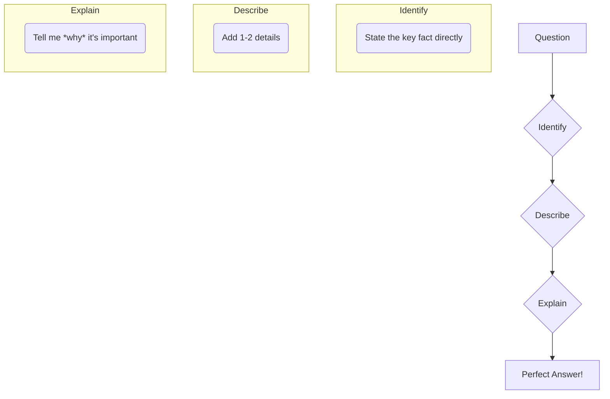

# The Golden Age of the Guptas: An Engaging Study Module

## Table of Contents
1.  **Unlocking the Past:** How We Know About the Guptas (Sources of History)
2.  **The First Great King:** Chandragupta I and the Rise of the Dynasty
3.  **The "Indian Napoleon":** Samudragupta's Conquests and Legacy
4.  **The Golden Zenith:** Chandragupta II (Vikramaditya) and Fa-Hien's India
5.  **Governing the Empire:** The Gupta Administration
6.  **A Flourishing of Genius:** Culture, Science, and Art in the Gupta Era

---

# Segment 1: Unlocking the Past - How We Know About the Guptas

### In This Segment
- [🎯 **Your Mission**](#-your-mission-in-this-segment)
- [🕵️‍♂️ **The Time Detective's Toolkit**](#story-mode-the-time-detectives-toolkit-️)
- [✍️ **Mission Debrief: How to Ace Your Exam Answers**](#mission-debrief-how-to-ace-your-exam-answers-️)
- [🧠 **Exam Prep Practice Zone**](#-exam-prep-practice-zone)
- [🤔 **Critical Thinking Corner**](#-critical-thinking-corner)

---

### 🎯 Your Mission in This Segment

By the end of this mission, you will be able to:
*   **Identify** the key literary and archaeological clues that historians use.
*   **Explain** what a Chinese traveler's diary reveals about life in the Gupta Empire.
*   **Describe** how a single stone pillar tells the story of a great conqueror.
*   **Analyze** why coins, ruins, and inscriptions are crucial pieces of the historical puzzle.

---

### Story Mode: The Time Detective's Toolkit 🕵️‍♂️

How do we know what a king wore, what people ate, or what songs they sang 1,700 years ago? We can't use a time machine, but we can be **Time Detectives**! Our clues aren't fingerprints; they are historical sources left behind. For the Gupta Empire, these clues are so rich and detailed that they paint a vivid picture of a "Golden Age."

Our detective kit has two main trays: **Literary Sources** (written accounts) and **Archaeological Sources** (physical objects). Let's examine the evidence.

---

### Tray 1: The Written Clues (Literary Sources) 📜

#### **Clue #1: The Foreign Correspondent's Diary (Fa-Hien's Account)**

**The Story:** Imagine a Buddhist monk from China, **[Fa-Hien](https://en.wikipedia.org/wiki/Faxian)**, walking thousands of miles to India on a quest for original Buddhist scriptures. He was like a foreign journalist reporting from a distant, fascinating land during the reign of the great king **Chandragupta II**. His book, **Fo-Kwo-Ki** (A Record of Buddhist Kingdoms), is a treasure trove of information.

**Detective's Notes (What his diary tells us):**
*   **A Prosperous Land:** Magadha was wealthy, with large towns. Pataliputra (modern-day Patna) was a flourishing city with amazing charitable institutions, including a **free hospital** funded by benevolent citizens.
*   **Peaceful & Honest Society:** Despite their wealth, people lived simple lives and were honest and law-abiding. The roads were safe for travelers.
*   **Mild Government:** The penal code was gentle. Most crimes were punished with fines, and capital punishment was rare.
*   **Religious Harmony:** Vaishnavism, Shaivism, Buddhism, and Jainism all co-existed peacefully. There was no ill will between different faiths.
*   **Social Structure:** The caste system existed, and Fa-Hien noted the presence of 'Chandalas' (outcasts) who lived outside the main towns.

> **🧠 Active Recall Checkpoint #1:** According to Fa-Hien, if you committed a minor crime in the Gupta Empire, what would your most likely punishment be?

#### **Clue #2: The Celebrity Authors (Kalidasa & Vishakhadatta)**

**The Story:** The Gupta court was filled with literary superstars. The most famous was **Kalidasa**, the "Shakespeare of India." His epic plays (like *Abhijnanashakuntalam*) and poems give us a glimpse into the culture, ideals, and royal life of the era. Another writer, **Vishakhadatta**, wrote a political thriller called *Devi Chandraguptam*, which reveals the dramatic story of Chandragupta II's rise to power.

**Detective's Notes:**
*   These works are like the "prestige dramas" of their time, offering rich details about the society and its values.

> **🧠 Active Recall Checkpoint #2:** Which author wrote a play about Chandragupta II's early life?

#### **Clue #3: The Ancient Encyclopedias (The Puranas)**

**The Story:** The Puranas are ancient Hindu texts that mix mythology with history. For a historian, they are a goldmine for tracking the family trees (genealogies) of kings.

**Detective's Notes:**
*   The **Vayu Purana**, for instance, is crucial for listing out the early rulers of the Gupta dynasty.

---

### Tray 2: The Physical Clues (Archaeological Sources) 🏛️

#### **Clue #1: The King's Resume on a Pillar (Allahabad Inscription)**

**The Story:** Imagine a king, **Samudragupta**, so proud of his victories that he has them all carved onto a massive stone pillar for everyone to see, forever. This is the **[Allahabad Pillar Inscription](https://en.wikipedia.org/wiki/Allahabad_pillar)** (also known as the *Prayaga Prashasti*). It's a long, powerful poem written in Sanskrit by his court poet, **Harisena**.

**Detective's Notes:**
*   This is the single most important source of information for Samudragupta's reign.
*   It gives a detailed list of the kings and tribal republics he conquered. It's like finding his official military resume, written in stone.

> **🧠 Active Recall Checkpoint #3:** Who wrote the inscription on the Allahabad Pillar?

#### **Clue #2: The Rustless Wonder (Iron Pillar at Mehrauli)**

**The Story:** Near the Qutub Minar in Delhi stands a 1,600-year-old iron pillar that has **never rusted**. This pillar is a mind-boggling marvel of ancient Indian metallurgy. An inscription on it celebrates the victories of a powerful king named 'Chandra,' who historians identify as **Chandragupta II**.

**Detective's Notes:**
*   This pillar is physical proof of the incredible scientific and engineering skills of the Gupta period.

#### **Clue #3: Pocket-Sized Propaganda (Coins)**

**The Story:** Gupta kings issued beautiful gold and silver coins. These weren't just money; they were mini-billboards.

**Detective's Notes:**
*   **Portraits & Titles:** They show us what the kings looked like and the grand titles they used (like *Maharajadhiraja*, or "king of great kings").
*   **Hobbies & Beliefs:** They reveal the gods they worshipped (Hindu gods and goddesses are depicted) and even their personal talents. One famous coin shows **Samudragupta playing the veena** (a stringed instrument).
*   **Dating the Past:** Coins help historians confirm the dates and timelines of different rulers.

> **🧠 Active Recall Checkpoint #4:** What hobby of Samudragupta's do we know about from his coins?

#### **Clue #4: The University in Ruins (Nalanda)**

**The Story:** The ruins of **[Nalanda University](https://whc.unesco.org/en/list/1502/)** in Bihar are a massive archaeological site. Founded during the reign of **Kumaragupta I**, it was one of the world's first great residential universities.

**Detective's Notes:**
*   Its vast libraries—with names like *Ratnasagar* (Ocean of Gems)—and the sheer scale of the ruins tell us that education was incredibly important to the Guptas.
*   Subjects taught included the Vedas, logic, medicine, and more, showing a sophisticated curriculum.

---

### Mission Debrief: How to Ace Your Exam Answers ✍️

Knowing the facts is half the battle. The other half is presenting them clearly. Here’s a proven method to structure your answers, from short questions to long ones.

#### The "I-D-E" Method: Identify, Describe, Explain

This simple technique ensures you give a complete and impressive answer every time.

---

#### **Level 1: Short Answer Questions**

Let's tackle a question from your guidebook:
> **"Name the famous Inscription that tells us about the character and military achievements of Samudragupta."**

**Building the Perfect Answer with I-D-E:**

*   **(I)dentify:** The Allahabad Pillar Inscription.
*   **(D)escribe:** It is a *prashasti* (a eulogy praising a king) composed in Sanskrit by his court poet, Harisena.
*   **(E)xplain:** It is the most important source for his reign because it provides a detailed list of the kings and kingdoms he conquered, giving us a clear picture of his military power.

**Your Final Answer:**
"The famous inscription is the **Allahabad Pillar Inscription**. It was composed as a *prashasti* (eulogy) in Sanskrit by Samudragupta's court poet, Harisena. It is historically vital as it details his character and military achievements, listing the specific rulers and regions he conquered."

---

#### **Level 2: Structured Questions**

Let's try a longer one from your guidebook:
> **"Regarding archaeological sources to reconstruct the Age of the Gupta, explain what significance do the following have: (a) Allahabad Pillar Inscription (b) Nalanda University"**

**Building the Perfect Answer with I-D-E (for each part):**

**(a) Allahabad Pillar Inscription**

*   **Point 1: What is it?**
    *   **(I)dentify:** The Allahabad Pillar Inscription is the most significant epigraphic (inscribed) source for the Gupta period, specifically for the reign of Samudragupta.
    *   **(D)escribe:** It was written by his court poet Harisena and is carved on an Ashokan pillar in Prayagraj.
    *   **(E)xplain:** Its significance lies in its detailed, firsthand account of Samudragupta's conquests, which allows historians to map the extent of his empire and understand his policies towards defeated kings.

*   **Point 2: What does it contain?**
    *   **(I)dentify:** The inscription contains an impressive list of defeated kings and tribal republics.
    *   **(D)escribe:** It categorizes rulers into different groups, such as the nine kings of Aryavarta whose kingdoms were annexed, and the twelve rulers of the south who were defeated but allowed to rule as tributaries.
    *   **(E)xplain:** This shows that Samudragupta was not just a conqueror but also a clever statesman, using different strategies to manage his vast empire.

**(b) Nalanda University**

*   **Point 1: What was it?**
    *   **(I)dentify:** Nalanda was a world-renowned Buddhist monastery and educational institution in Bihar, founded during the reign of Kumaragupta I.
    *   **(D)escribe:** It was a massive complex with multiple colleges and three great libraries: Ratnasagar, Ratnodadhi, and Ratnaranjak.
    *   **(E)xplain:** Its significance is that it stands as a testament to the importance of education during the Gupta era. It was a post-graduate institution that attracted thousands of students from all over Asia (including China, Tibet, and Korea), making it a global hub of knowledge.

*   **Point 2: What was taught?**
    *   **(I)dentify:** The curriculum at Nalanda was vast and diverse.
    *   **(D)escribe:** Subjects included the Vedas, logic, grammar, medicine, philosophy, and various schools of Buddhist thought.
    *   **(E)xplain:** This shows the intellectual vibrancy of the period, where both religious and secular subjects were studied at the highest level, solidifying the Gupta Age's reputation as a "Golden Age" of learning.

---

### 🤔 Critical Thinking Corner

The Allahabad Pillar inscription was written by Samudragupta's own court poet. Do you think it gives a completely unbiased account of his reign? Why or why not? What might be exaggerated?

This exercise helps you think like a real historian, questioning the sources and looking for the full story!

---

### 🧠 Exam Prep Practice Zone

Here is a list of questions from your guidebook that are relevant to this segment. Use the "I-D-E" method you learned above to practice writing complete answers.

**Short Answer Questions:**
1.  Name one literary and one archaeological source for the Gupta period.
2.  What is the title of the book Fa-Hien wrote about India?
3.  What did Fa-Hien write about the city of Pataliputra?
4.  Who was the greatest literary genius of the Gupta period? Name two of his dramas and two of his epics.
5.  During whose reign did Fa-Hien visit India?
6.  What does the Allahabad Pillar Inscription tell us about?
7.  Who destroyed Nalanda University?

**Structured Questions:**
1.  "There are many literary sources to reconstruct the Age of the Guptas." In this context, explain the literary accounts of Fa-Hien.
2.  Regarding archaeological sources, explain the significance of:
    *   The Allahabad Pillar Inscription
    *   Nalanda University
3.  With reference to Nalanda University, answer the following:
    *   Under whose patronage did it become a famous center of learning?
    *   Describe three of its special features.
