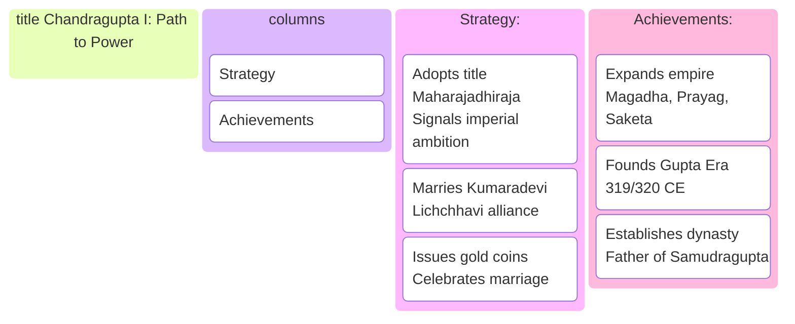
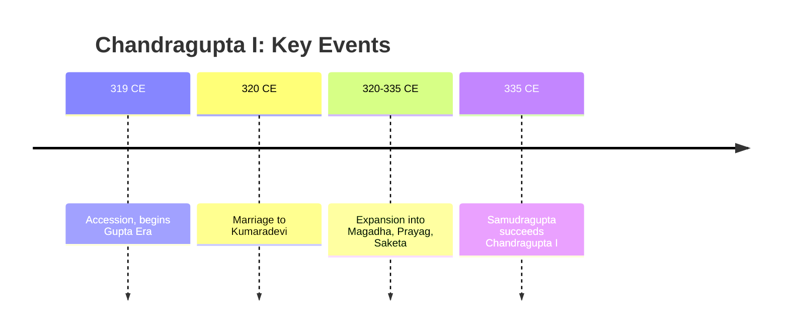
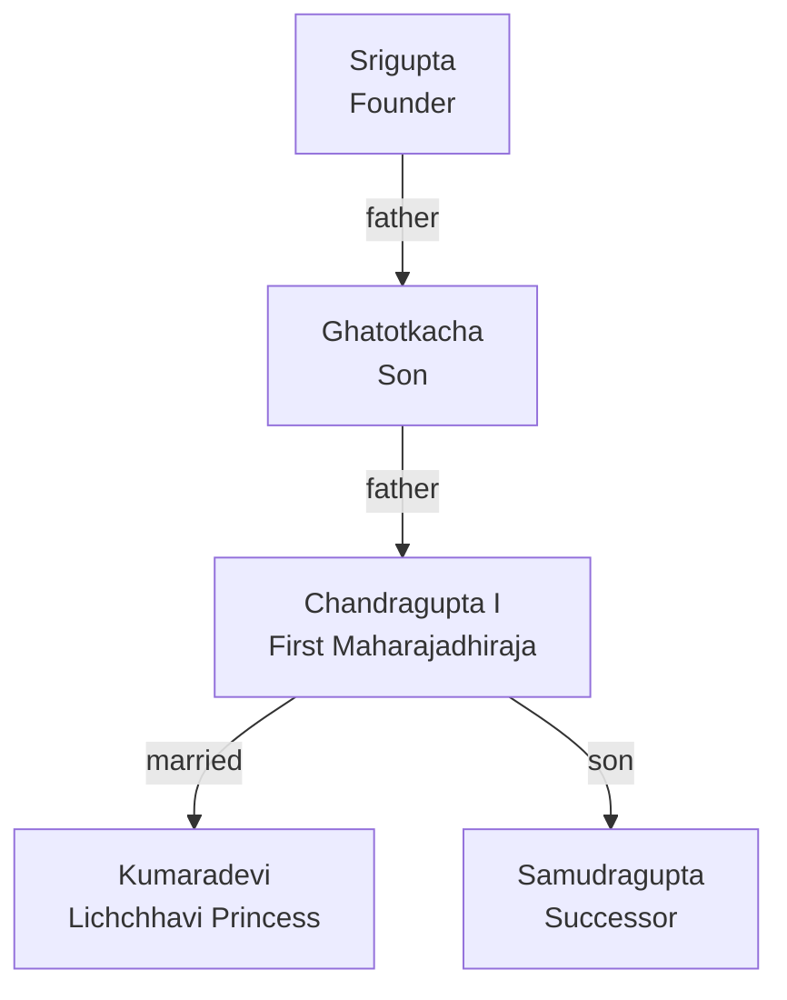

# Segment 2: The First Maharajadhiraja - Chandragupta I

## Documentary Study Module

### 📋 Table of Contents - Section 2
- [Segment 2: The First Maharajadhiraja - Chandragupta I](#segment-2-the-first-maharajadhiraja---chandragupta-i)
  - [Documentary Study Module](#documentary-study-module)
    - [📋 Table of Contents - Section 2](#-table-of-contents---section-2)
  - [🎬 The Documentary Story](#-the-documentary-story)
  - [🔑 Memory Hooks](#-memory-hooks)
  - [🎨 Visual Learning](#-visual-learning)
  - [🗂️ Visual Kanban: Chandragupta I's Path to Power](#️-visual-kanban-chandragupta-is-path-to-power)
  - [🗓️ Timeline: Chandragupta I's Reign](#️-timeline-chandragupta-is-reign)
  - [🧠 Active Recall \& Exam Practice](#-active-recall--exam-practice)
    - [60-Second Cram Card](#60-second-cram-card)
    - [Long-Answer Drill (5 minutes)](#long-answer-drill-5-minutes)
    - [One-Mark Questions](#one-mark-questions)
    - [Short Answer Questions (2-3 marks)](#short-answer-questions-2-3-marks)
    - [Long Answer Questions (5 marks)](#long-answer-questions-5-marks)
  - [📖 Glossary \& Deep Dive](#-glossary--deep-dive)
  - [🃏 Flashcards](#-flashcards)
    - [🌟 Ready for the Next Chapter!](#-ready-for-the-next-chapter)

---

## 🎬 The Documentary Story

The story of the Gupta Empire doesn't begin with a bang, but with a whisper. The first two rulers, Srigupta and his son Ghatotkacha, were minor chiefs, local players in a fragmented political landscape. But in 319 CE, the whisper became a roar. Ghatotkacha's son, Chandragupta I, ascended the throne, and he had ambitions that stretched far beyond his small kingdom.

**From Chief to King of Kings**

Chandragupta I was a master strategist. He understood that in a world of petty kings and warring factions, a grand title was a declaration of intent. He was the first in his dynasty to adopt the magnificent title **Maharajadhiraja**—the "King of Great Kings." This wasn't just a boast; it was a challenge to every other ruler in northern India. It signaled the arrival of a new imperial power.

His genius, however, wasn't just in titles. It was in action. Chandragupta I knew that conquest alone wasn't enough to build an empire. He needed powerful allies. His most brilliant move was a strategic matrimonial alliance with the **Lichchhavis**, an ancient and powerful clan that controlled vital territories. He married the Lichchhavi princess, **Kumaradevi**.

This marriage was a political masterstroke. It gave him immense prestige, control over valuable resources, and a secure northern frontier. The alliance was so important that Chandragupta I issued a special series of gold coins to commemorate it. These coins, featuring the portraits of both the king and queen, were a public announcement of the partnership that launched the Gupta dynasty onto the imperial stage.

With his power consolidated, Chandragupta I began a systematic campaign of expansion. He brought the fertile lands of **Magadha** (South Bihar), **Prayag** (modern Prayagraj), and **Saketa** (near Ayodhya) under his direct rule. His reign, which marked the beginning of the **Gupta Era** in 319/320 CE, transformed a minor chiefdom into a formidable empire. He laid the strong foundation upon which his son, the legendary Samudragupta, would build one of the greatest empires in Indian history.

---

## 🔑 Memory Hooks

*   **Title Hook:** Chandragupta I was the **FIRST** to take the title **Maharajadhiraja**. Think "Maha" = "Mega" ambition.
*   **Marriage Hook:** His marriage to **Kumaradevi** of the Lichchhavi clan was his **KEY** to power. **Chandragupta + Kumaradevi = Imperial Power**.
*   **Coin Hook:** He celebrated his marriage on **gold coins**, a public display of his most important alliance.
*   **Timeline Hook:** His reign (starting 319/320 CE) marks the official beginning of the **Gupta Era**.

---

## 🎨 Visual Learning
## 🗂️ Visual Kanban: Chandragupta I's Path to Power


*Caption: Kanban board showing Chandragupta I's strategies and achievements.*

## 🗓️ Timeline: Chandragupta I's Reign


*Caption: Timeline of Chandragupta I's reign and major milestones.*

```mermaid
mindmap
  root((Chandragupta I<br/>The Empire Builder))
    Title["Maharajadhiraja<br/>(King of Great Kings)"]
    Marriage[Strategic Marriage<br/>to Kumaradevi (Lichchhavi Princess)]
    Expansion[Territorial Expansion<br/>Magadha, Prayag, Saketa]
    Legacy[Founder of the Gupta Era<br/>(Starting 319/320 CE)]
    Commemoration[Gold Coins<br/>Featuring King & Queen]
```
*Caption: A mindmap summarizing the key strategies and achievements of Chandragupta I.*

---

## 🧠 Active Recall & Exam Practice
### 60-Second Cram Card
**Chandragupta I transformed the Gupta family from minor chiefs to imperial rulers. He was the first to use the title Maharajadhiraja, married Kumaradevi of the Lichchhavis for a powerful alliance, and commemorated this on gold coins. His reign (starting 319/320 CE) marks the Gupta Era, and he expanded the empire to include Magadha, Prayag, and Saketa. He laid the foundation for the dynasty’s golden age.**

### Long-Answer Drill (5 minutes)
**Practice Question:** "Explain how Chandragupta I’s strategic alliances and conquests laid the foundation for the Gupta Empire’s greatness."

### One-Mark Questions
1.  What was the title adopted by Chandragupta I?
2.  Who was the wife of Chandragupta I?
3.  Which clan did Kumaradevi belong to?
4.  How did Chandragupta I commemorate his marriage alliance?
5.  What year marks the beginning of the Gupta Era?
6.  Name two territories conquered by Chandragupta I.
7.  Who was the father of Chandragupta I?
8.  Who was the son and successor of Chandragupta I?

### Short Answer Questions (2-3 marks)
1.  Explain the significance of the title "Maharajadhiraja."
2.  Why was the matrimonial alliance with the Lichchhavis important for Chandragupta I?
3.  What do the gold coins of Chandragupta I tell us about his reign?
4.  Describe the extent of Chandragupta I's empire.

### Long Answer Questions (5 marks)
1.  **"Chandragupta I was the real founder of the Gupta Empire."** Discuss this statement, highlighting his key contributions.
2.  Explain how Chandragupta I used a combination of military conquest and matrimonial alliances to expand his kingdom.

---

## 📖 Glossary & Deep Dive

*Caption: Family tree of the early Gupta dynasty with labeled relationships.*

**Chandragupta I (319-335 CE):** The first great ruler of the Gupta dynasty, who elevated the family from minor chiefs to imperial status. He began the Gupta Era and set the stage for the dynasty's golden age.

**Srigupta:** Founder of the Gupta dynasty, grandfather of Chandragupta I.

**Ghatotkacha:** Father of Chandragupta I, a minor chief before the rise of the dynasty.

**Maharajadhiraja:** Sanskrit title meaning "King of Great Kings" or "Emperor." Its adoption signified supreme, independent power and imperial ambition.

**Lichchhavis:** Ancient and powerful republican clan based in the region of modern-day Bihar. Their alliance was crucial for the early Guptas.

**Kumaradevi:** Lichchhavi princess who married Chandragupta I. This matrimonial alliance was a cornerstone of his political strategy and is commemorated on gold coins.

**Gupta Era:** Historical era that began in 319/320 CE, coinciding with the accession of Chandragupta I. Used as a reference for dating events in the Gupta period.

**Matrimonial Alliance:** Marriage arranged for political reasons, to create alliances, secure territory, or gain prestige. Chandragupta I's marriage to Kumaradevi is a classic example.

**Gold Coins (Gupta):** Special coins issued by Chandragupta I to commemorate his marriage to Kumaradevi, featuring both king and queen. These coins are key archaeological evidence for his reign.

**Magadha:** Fertile region in South Bihar, one of the main territories added to the Gupta Empire by Chandragupta I.

**Saketa:** Ancient city, identified with the region around modern Ayodhya, that was part of Chandragupta I's empire.

**Prayag:** Ancient city, now known as Prayagraj, that was a key territory under Gupta rule.

**Dynastic Succession:** The process by which royal power is passed from one ruler to the next. Chandragupta I was succeeded by his son, Samudragupta.

**Imperial Foundation:** The act of establishing a dynasty or empire. Chandragupta I is credited as the real founder of the Gupta Empire.

---

## 🃏 Flashcards
**Card 6**
Q: What is the significance of the Gupta Era?
A: It marks the official start of the Gupta dynasty, beginning with Chandragupta I’s reign in 319/320 CE.

**Card 7**
Q: What was commemorated on Chandragupta I’s gold coins?
A: His marriage alliance with Kumaradevi, showing both king and queen.

**Card 8**
Q: Who succeeded Chandragupta I?
A: His son, Samudragupta.

**Card 9**
Q: Which regions did Chandragupta I add to his empire?
A: Magadha, Prayag, Saketa.

**Card 10**
Q: What was the political importance of Chandragupta I’s marriage?
A: It secured a powerful alliance with the Lichchhavis, boosting his prestige and territorial control.
**Srigupta:** Founder of the Gupta dynasty, grandfather of Chandragupta I.
**Ghatotkacha:** Father of Chandragupta I, a minor chief before the rise of the dynasty.

**Card 1**
Q: What grand title did Chandragupta I adopt?
A: Maharajadhiraja (King of Great Kings).

**Card 2**
Q: Who did Chandragupta I marry to form a key political alliance?
A: Kumaradevi, a Lichchhavi princess.

**Card 3**
Q: What event marks the beginning of the Gupta Era?
A: The accession of Chandragupta I in 319/320 CE.

**Card 4**
Q: How do we know the marriage to Kumaradevi was important?
A: It was commemorated on special gold coins featuring both the king and queen.

**Card 5**
Q: Name two regions Chandragupta I added to his empire.
A: Magadha (South Bihar) and Prayag (Prayagraj).

---

### 🌟 Ready for the Next Chapter!

You've now covered the strategic genius who laid the groundwork for the Gupta Empire. Next, we'll see how his son, Samudragupta, took this foundation and built an empire that would dominate India.
