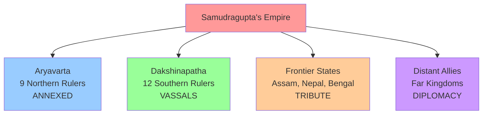

# Segment 3: The "Indian Napoleon" — Samudragupta's Conquests and Legacy

---

## **PART 1: THE STORY** �

### 🎬 The Rise of a Conqueror

Imagine a time when India was a patchwork of kingdoms, each vying for power. Into this world stepped **Samudragupta (335–375 CE)**, the son of Chandragupta I—a ruler whose ambition and genius would earn him the nickname **"Indian Napoleon."**

Unlike Napoleon's later conquests across Europe, Samudragupta's campaigns were methodical, strategic, and designed not just to conquer but to create a lasting empire. His court poet Harisena wrote about him: *"His fame was earned by the sword"* — but this king was far more than a warrior.

### 🎨 Samudragupta's Four-Fold Strategy


### 🏛️ The Allahabad Pillar: Ancient Documentary

Picture this: An ancient stone pillar from Ashoka's time becomes the canvas for the greatest eulogy ever written about an Indian emperor. **Harisena**, Samudragupta's brilliant court poet, carved 32 lines of Sanskrit poetry that systematically lists every victory, every strategy, every achievement.

**The Four Categories of Rulers:**
1. **Northern Kings (Aryavarta):** 9 rulers defeated → territories directly absorbed
2. **Southern Kings (Dakshinapatha):** 12 rulers defeated → allowed to rule as vassals  
3. **Frontier States:** Assam, Bengal, Nepal → paid tribute and attended court
4. **Distant Allies:** Far-off kingdoms → offered gifts and marriage alliances

### � The Warrior-Artist

But here's what makes Samudragupta extraordinary: He could compose poetry in the morning and lead cavalry charges in the afternoon! His famous **"Lyrist Type"** coins show him playing the **Veena**, proving that true kingship combined strength with culture.

### 🐎 The Ultimate Power Move: Ashvamedha

To declare himself the undisputed emperor, Samudragupta performed the ancient **Ashvamedha Yajna** (horse sacrifice). A consecrated horse wandered for a year across kingdoms. The rule was simple: **Submit to Samudragupta or fight his army.** The horse's successful return meant one thing—Samudragupta was the emperor of India.

### 🔑 Remember: The HORSE Method
- **H**arisena wrote the Allahabad inscription  
- **O**rganized empire into 4 categories
- **R**uler-musician (Veena player)
- **S**acrificed horse in Ashvamedha
- **E**mpire from Assam to Punjab

---

## **PART 2: EXAM MASTERY** 🎯
```mermaid
graph TB
    A[Pataliputra<br/>Capital] --> B[Northern India<br/>Aryavarta<br/>Direct Rule]
    A --> C[Southern India<br/>Dakshinapatha<br/>Vassals]
    A --> D[Frontier States<br/>Tribute]
    A --> E[Distant Allies<br/>Diplomacy]
    
    B --> B1[Kaushambi]
    B --> B2[Mathura]
    B --> B3[Ahichchatra]
    
    C --> C1[Pallava Kingdom]
    C --> C2[Pandya Kingdom]
    C --> C3[Chola Kingdom]
    
    D --> D1[Assam]
    D --> D2[Nepal]
    D --> D3[Bengal Coast]
    
    E --> E1[Kushana Remnants]
    E --> E2[Saka Territories]
    
    style A fill:#ff9999
    style B fill:#99ccff
    style C fill:#99ff99
    style D fill:#ffcc99
    style E fill:#cc99ff
---

## **PART 2: EXAM MASTERY** 🎯

### ⚡ 60-Second Quick Facts
- **WHO:** Samudragupta (335-375 CE), "Indian Napoleon"
- **WHAT:** Greatest Gupta conqueror, expanded empire across India
- **WHERE:** From Assam to Punjab, Himalayas to Narmada River  
- **HOW:** Four-tier strategy: Annexation, Vassalage, Tribute, Diplomacy
- **SOURCE:** Allahabad Pillar Inscription by Harisena (32 lines)

### 📝 Essential Questions & Answers

**1-Mark Questions:**
1. Who wrote the Allahabad Pillar Inscription? → **Harisena**
2. How many Aryavarta rulers did Samudragupta defeat? → **9 rulers**
3. What instrument did Samudragupta play? → **Veena**
4. What sacrifice did he perform to assert supremacy? → **Ashvamedha Yajna**

**2-3 Mark Questions:**
1. **Explain Samudragupta's four categories of rulers.**
   - Aryavarta: 9 northern rulers annexed directly
   - Dakshinapatha: 12 southern rulers became vassals
   - Frontier states: Tribute payers (Assam, Nepal, Bengal)
   - Distant allies: Diplomatic relations with far kingdoms

2. **What evidence shows Samudragupta was both warrior and artist?**
   - Military conquests across India
   - Played Veena (shown on "Lyrist Type" coins)
   - Wrote poetry and patronized scholars
   - Court filled with artists and intellectuals

**5-Mark Questions:**
1. **"Samudragupta was not just a conqueror but a statesman." Justify.**
   - **Strategic approach:** Different treatment for different regions
   - **Administrative wisdom:** Direct rule vs. local autonomy balance
   - **Cultural integration:** Respected local traditions while expanding
   - **Diplomatic skill:** Used marriage alliances and tribute systems
   - **Long-term vision:** Created lasting empire structure

### 🃏 Power Flashcards (Just 4!)

**Card 1:** "Indian Napoleon" = **Samudragupta** (systematic empire-building genius)

**Card 2:** **4 Categories** = Aryavarta (annexed), Dakshinapatha (vassals), Frontier (tribute), Distant (diplomacy)

**Card 3:** **Allahabad Pillar** = 32-line Sanskrit poem by Harisena, our main source

**Card 4:** **Warrior + Artist** = Military conquests + Veena player + Ashvamedha performer

### 🏆 Exam Success Formula
1. **Read the story** (Part 1) to understand and remember
2. **Practice the questions** (Part 2) to score marks  
3. **Use HORSE method** to recall key facts
4. **Remember the visual** of his four-tier empire strategy

---

**Next Chapter Preview:** How Samudragupta's brilliant empire-building led to the true Golden Age under Chandragupta II Vikramaditya!

*Remember: History is about understanding smart people who solved big problems. Samudragupta's four-tier strategy is still studied by modern leaders!*