# Segment 3: The "Indian Napoleon" — Samudragupta's Conquests and Legacy

## Section Content

### 📋 Table of Contents
- [Segment 3: The "Indian Napoleon" — Samudragupta's Conquests and Legacy](#segment-3-the-indian-napoleon--samudraguptas-conquests-and-legacy)
  - [Section Content](#section-content)
    - [📋 Table of Contents](#-table-of-contents)
  - [Samudragupta: Conquests and Legacy](#samudragupta-conquests-and-legacy)
  - [🔑 Memory Hooks](#-memory-hooks)
  - [🎨 Visual Learning](#-visual-learning)
  - [🗂️ User Journey: Samudragupta's Campaigns](#️-user-journey-samudraguptas-campaigns)
  - [🗓️ Timeline: Samudragupta's Reign](#️-timeline-samudraguptas-reign)
  - [🧠 Active Recall \& Exam Practice](#-active-recall--exam-practice)
    - [60-Second Cram Card](#60-second-cram-card)
    - [Long-Answer Drill (5 minutes)](#long-answer-drill-5-minutes)
    - [One-Mark Questions](#one-mark-questions)
    - [Short Answer Questions (2-3 marks)](#short-answer-questions-2-3-marks)
    - [Long Answer Questions (5 marks)](#long-answer-questions-5-marks)
  - [� Glossary \& Deep Dive](#-glossary--deep-dive)
  - [🃏 Flashcards](#-flashcards)
    - [🌟 Ready for the Next Chapter!](#-ready-for-the-next-chapter)

---

## Samudragupta: Conquests and Legacy

Samudragupta (335–375 CE), son of Chandragupta I, is celebrated as one of the greatest military geniuses in Indian history. His reign transformed the Gupta Empire from a regional power into a vast dominion stretching from the Brahmaputra in the east to the Yamuna and Chambal in the west, and from the Himalayas in the north to the Narmada in the south.

**The Conqueror and Statesman**

Samudragupta’s military exploits are legendary. He defeated the Naga kings of Mathura, Gwalior, and Ahichhatra, and his most famous campaign was in the Deccan, where he covered 3,000 miles through dense forests, rivaling the boldness of Alexander and Napoleon. Unlike other conquerors, Samudragupta did not annex the Deccan; instead, he made southern kings accept his suzerainty, showing wisdom and restraint.

He subjugated forest tribes in Central India, defeated nine republican tribes of Rajasthan, and received tributes from frontier states like Bengal, Assam, Nepal, and Kartarpur. His diplomatic skills ensured friendly relations with neighboring powers such as the Shakas, Kushanas, and the king of Sri Lanka.

**The Patron of Arts and Letters**

Samudragupta was not just a conqueror—he was a patron of art, music, and literature. He played the Veena, wrote poetry, and supported scholars. His coins depict him as a musician, highlighting his cultural achievements.

**The Allahabad Pillar Inscription**

The Allahabad Pillar Inscription, composed by his court poet Harisena, provides a detailed account of his conquests and policies. It categorizes rulers into four groups: those defeated and annexed, those made subordinate allies, neighboring states that paid tribute, and distant rulers who offered gifts and alliances.

**Legacy**

Samudragupta performed the Ashvamedha Yajna (horse sacrifice) to assert his sovereignty. He is remembered as the "Indian Napoleon" for his military brilliance, but also for his tolerance, wisdom, and cultural contributions. His reign laid the foundation for the Gupta golden age.

---

## 🔑 Memory Hooks

* **Napoleon Hook:** Samudragupta is called the "Indian Napoleon" for his unmatched military conquests.
* **Deccan Campaign Hook:** He conquered the south but did not annex it—he preferred suzerainty over direct rule.
* **Veena Hook:** Coins show Samudragupta playing the Veena, symbolizing his love for music and the arts.
* **Inscription Hook:** The Allahabad Pillar Inscription is the key source for his reign and achievements.
* **Ashvamedha Hook:** He performed the Ashvamedha Yajna to assert imperial power.

---

## 🎨 Visual Learning

## 🗂️ User Journey: Samudragupta's Campaigns

*Caption: User journey diagram showing Samudragupta’s rise, conquests, diplomacy, and legacy.*

## 🗓️ Timeline: Samudragupta's Reign

*Caption: Timeline of Samudragupta’s reign and major milestones.*

```mermaid
mindmap
	root((Samudragupta<br/>Indian Napoleon))
		Conquests[Military Campaigns<br/>North & South India]
		Diplomacy[Tribute & Alliances<br/>Frontier & Distant States]
		Arts[Patron of Music & Literature<br/>Plays Veena]
		Inscription[Allahabad Pillar<br/>Harisena’s Account]
		Rituals[Ashvamedha Yajna<br/>Imperial Assertion]
		Legacy[Foundation for Gupta Golden Age]
```

*Caption: Mindmap summarizing Samudragupta’s strategies, achievements, and legacy.*

---

## 🧠 Active Recall & Exam Practice
### 60-Second Cram Card
**Samudragupta, the "Indian Napoleon," expanded the Gupta Empire through brilliant military campaigns, especially in the north and Deccan. He preferred suzerainty over direct rule in the south, received tributes from frontier states, and maintained diplomatic relations. A patron of the arts, he played the Veena and supported scholars. The Allahabad Pillar Inscription records his achievements. He performed the Ashvamedha Yajna and laid the foundation for the Gupta golden age.**

### Long-Answer Drill (5 minutes)
**Practice Question:** "Discuss Samudragupta’s military and diplomatic strategies. How did they contribute to the greatness of the Gupta Empire?"

### One-Mark Questions
1.  Who was Samudragupta’s father?
2.  What title is Samudragupta often given by historians?
3.  Which inscription is the main source for Samudragupta’s reign?
4.  Name one frontier state that paid tribute to Samudragupta.
5.  What musical instrument did Samudragupta play?
6.  What was the Ashvamedha Yajna?
7.  Who succeeded Samudragupta?

### Short Answer Questions (2-3 marks)
1.  Why is Samudragupta called the "Indian Napoleon"?
2.  What was unique about Samudragupta’s Deccan campaign?
3.  How did Samudragupta use diplomacy to expand his empire?
4.  What does the Allahabad Pillar Inscription tell us about Samudragupta?

### Long Answer Questions (5 marks)
1.  **"Samudragupta’s reign marked the beginning of the Gupta golden age."** Discuss, with reference to his achievements.
2.  Explain how Samudragupta balanced conquest and diplomacy in his rule.

---

## � Glossary & Deep Dive
**Samudragupta (335–375 CE):** The greatest Gupta emperor, known for his military conquests, diplomacy, and cultural achievements.

**Chandragupta I:** Father of Samudragupta, founder of the Gupta imperial line.

**Naga Kings:** Rulers of Mathura, Gwalior, and Ahichhatra, defeated by Samudragupta.

**Deccan Campaign:** Samudragupta’s famous southern expedition, marked by suzerainty rather than annexation.

**Suzerainty:** Indirect rule—southern kings remained in power but acknowledged Samudragupta’s supremacy.

**Allahabad Pillar Inscription:** Key historical source, composed by Harisena, detailing Samudragupta’s conquests and policies.

**Ashvamedha Yajna:** Ancient horse sacrifice ritual performed by Samudragupta to assert imperial power.

**Veena:** Stringed musical instrument played by Samudragupta, symbolizing his patronage of the arts.

**Harisena:** Court poet of Samudragupta, author of the Allahabad Pillar Inscription.

**Frontier States:** Bengal, Assam, Nepal, Kartarpur—paid tribute to Samudragupta.

**Gupta Golden Age:** Period of cultural and political flourishing initiated by Samudragupta’s reign.

---

## 🃏 Flashcards
**Card 1**
Q: Who was Samudragupta’s father?
A: Chandragupta I.

**Card 2**
Q: What title is Samudragupta often given?
A: The "Indian Napoleon."

**Card 3**
Q: What is the Allahabad Pillar Inscription?
A: A key source detailing Samudragupta’s conquests and policies, written by Harisena.

**Card 4**
Q: What was unique about Samudragupta’s Deccan campaign?
A: He did not annex the south, but made southern kings accept his suzerainty.

**Card 5**
Q: Which musical instrument did Samudragupta play?
A: The Veena.

**Card 6**
Q: What ritual did Samudragupta perform to assert imperial power?
A: The Ashvamedha Yajna (horse sacrifice).

**Card 7**
Q: Name one frontier state that paid tribute to Samudragupta.
A: Bengal, Assam, Nepal, or Kartarpur.

**Card 8**
Q: Who succeeded Samudragupta?
A: Chandragupta II.

**Card 9**
Q: What does suzerainty mean?
A: Indirect rule—local kings remain in power but acknowledge the emperor’s supremacy.

**Card 10**
Q: Who was Harisena?
A: Samudragupta’s court poet and author of the Allahabad Pillar Inscription.

---

### 🌟 Ready for the Next Chapter!

You’ve now explored the conquests, diplomacy, and cultural legacy of Samudragupta—the "Indian Napoleon." Next, we’ll see how Chandragupta II built on this foundation to expand the Gupta Empire even further.
